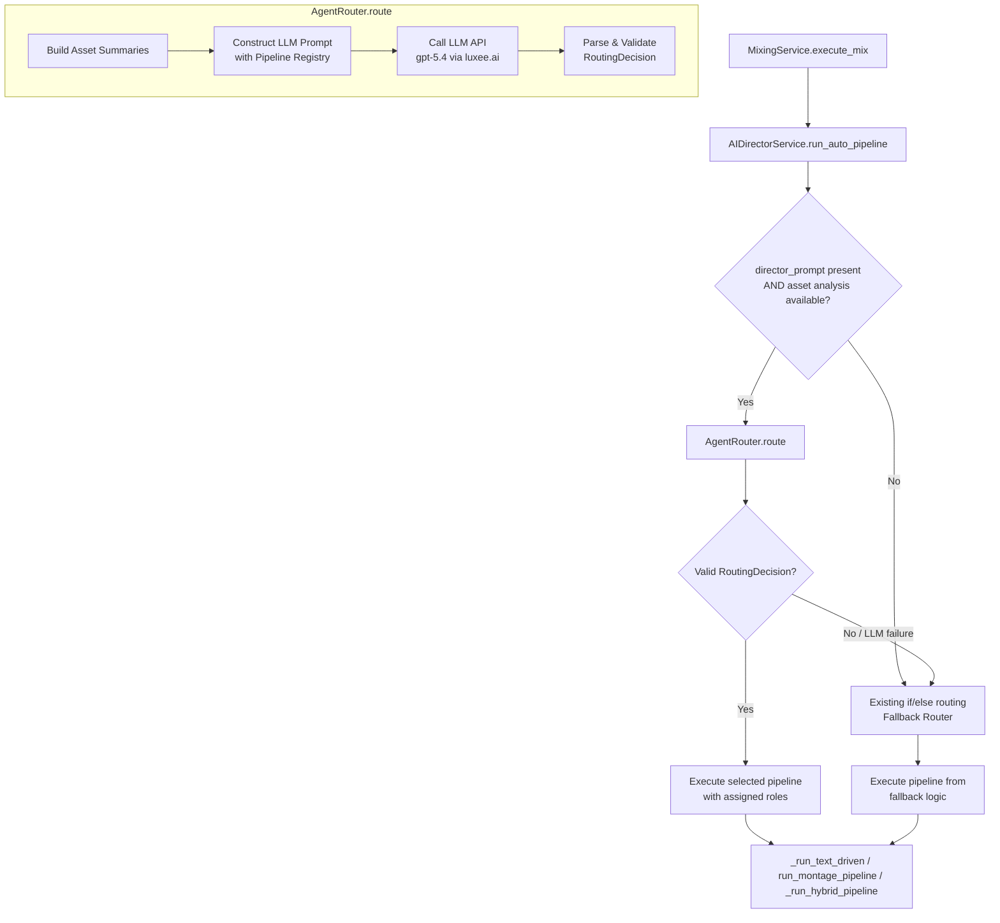
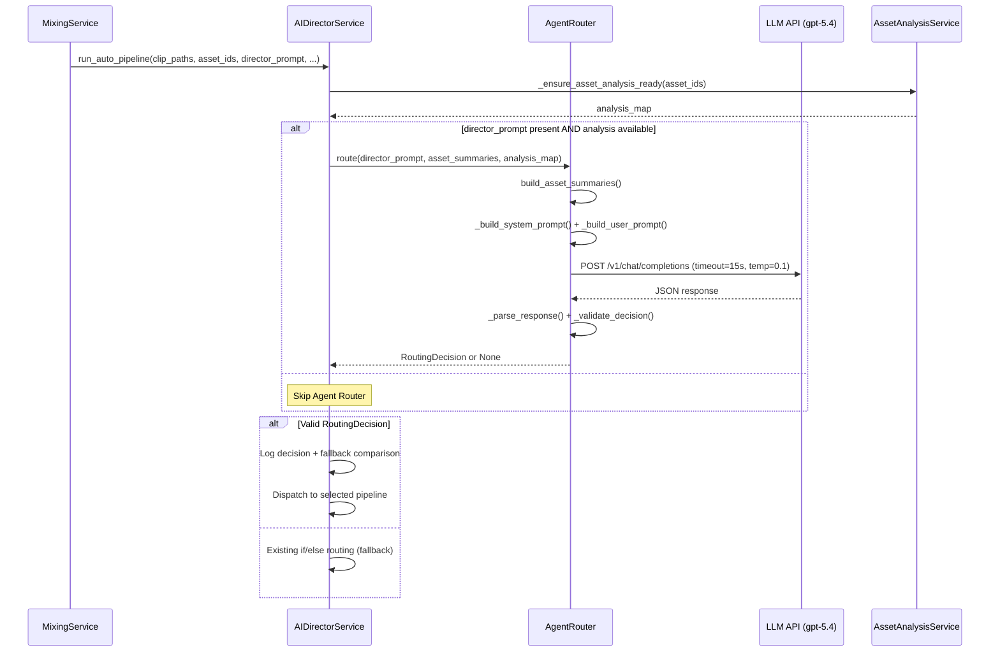

# Design Document: Agent Pipeline Routing

## Overview

This feature replaces the hardcoded if/else routing logic in `AIDirectorService.run_auto_pipeline()` with an LLM-powered Agent Router that considers both user intent (from `director_prompt`) and asset characteristics when selecting a pipeline.

The current routing logic in `run_auto_pipeline()` makes decisions purely based on asset analysis labels — if an asset has `has_speech=True` and `role="presenter"`, it routes to the text-driven pipeline; otherwise it falls back to the vision-driven montage pipeline. This ignores the user's natural language instructions entirely. For example, a user saying "混剪这些产品素材" (montage these product clips) gets forced into the hybrid pipeline simply because one asset has a presenter label.

The Agent Router introduces an LLM call between asset analysis loading and pipeline execution. It receives the `director_prompt`, asset summaries, and a pipeline registry, then returns a structured `RoutingDecision` containing the selected pipeline, asset role assignments, and pipeline-specific parameters. The existing if/else logic is preserved as a fallback for when the LLM call fails, ensuring zero-downtime degradation.

### Key Design Decisions

1. **Single new module (`agent_router.py`)** — All routing logic lives in a new module rather than being inlined into `ai_director_service.py`. This keeps the existing service clean and makes the router independently testable.

2. **Pipeline Registry as Python data** — The registry is a module-level constant (list of dataclasses), not an external config file. This keeps it version-controlled and type-checked alongside the code.

3. **Reuse `_get_llm_config` pattern** — The router follows the same LLM configuration resolution pattern used by `IntentParsingService`: try `text_llm` config → default provider → VLM fallback. This uses the existing `ExternalConfig` infrastructure.

4. **Reuse `_extract_json` pattern** — JSON parsing from LLM responses reuses the same approach as `IntentParsingService._extract_json()`: strip thinking tags, strip markdown fences, try direct parse, fall back to `{...}` extraction.

5. **Fallback-first integration** — `run_auto_pipeline()` attempts the Agent Router first; if it returns `None`, the existing if/else block runs unchanged. This means the feature can be deployed with zero risk — the worst case is equivalent to the current behavior.

## Architecture



### Data Flow

1. `MixingService.execute_mix()` calls `AIDirectorService.run_auto_pipeline()` (unchanged call site).
2. `run_auto_pipeline()` loads asset analysis data via `_ensure_asset_analysis_ready()` (unchanged).
3. **New step**: If `director_prompt` is non-empty and analysis data exists, call `AgentRouter.route()`.
4. `AgentRouter.route()` builds asset summaries, constructs the LLM prompt with the pipeline registry, calls the LLM, parses the response, and validates the result.
5. If a valid `RoutingDecision` is returned, `run_auto_pipeline()` dispatches to the selected pipeline method with the assigned asset roles.
6. If `AgentRouter.route()` returns `None` (any failure), the existing if/else routing logic executes as before.

### Module Boundaries

| Module | Responsibility |
|--------|---------------|
| `agent_router.py` (new) | Pipeline registry, asset summary construction, LLM prompt building, LLM call, response parsing, validation, `RoutingDecision` model |
| `ai_director_service.py` (modified) | Calls `AgentRouter.route()` before the existing if/else block; dispatches based on `RoutingDecision`; logs routing comparison |
| `external_config.py` (unchanged) | Provides LLM provider configuration |
| `intent_parsing_service.py` (unchanged) | Extracts structural parameters — distinct from pipeline routing |

## Components and Interfaces

### 1. AgentRouter (new class in `app/services/agent_router.py`)

```python
from dataclasses import dataclass
from typing import Optional

@dataclass
class RoutingDecision:
    """Structured output from the Agent Router."""
    pipeline: str                          # Pipeline identifier: text_driven | vision_montage | hybrid | multi_asset_montage
    asset_roles: dict[str, str]            # {asset_id: role_string}
    parameters: dict                       # Pipeline-specific parameters (ordering hints, audio source, etc.)
    raw_response: str                      # Original LLM response for logging

@dataclass
class PipelineInfo:
    """Describes a single pipeline in the registry."""
    identifier: str                        # e.g. "text_driven"
    name_zh: str                           # e.g. "口播裁剪"
    description_zh: str                    # Chinese description for LLM prompt
    expected_roles: list[str]              # e.g. ["presenter"] or ["montage_clip"]
    trigger_keywords: list[str]            # e.g. ["裁剪口播", "trim presenter"]

@dataclass
class AssetSummary:
    """Condensed asset info for the LLM prompt."""
    asset_id: str
    original_filename: str
    role: str                              # From analysis, or "unknown"
    has_speech: bool | None                # None if analysis unavailable
    description: str                       # Truncated to 100 chars
    duration: float                        # Seconds

class AgentRouter:
    """LLM-powered pipeline routing based on user intent + asset characteristics."""

    PIPELINE_REGISTRY: list[PipelineInfo]  # Module-level constant

    def __init__(self) -> None: ...

    def route(
        self,
        director_prompt: str,
        asset_summaries: list[AssetSummary],
        analysis_map: dict[str, dict | None],
    ) -> RoutingDecision | None:
        """Attempt LLM-based routing. Returns None on any failure."""
        ...

    def build_asset_summaries(
        self,
        asset_ids: list[str],
        clip_paths: list[str],
        clip_original_filenames: list[str] | None,
        analysis_map: dict[str, dict | None],
    ) -> list[AssetSummary]:
        """Construct AssetSummary list from analysis data and file metadata."""
        ...

    # Private methods
    def _get_llm_config(self) -> dict: ...
    def _build_system_prompt(self) -> str: ...
    def _build_user_prompt(self, director_prompt: str, summaries: list[AssetSummary]) -> str: ...
    def _call_llm(self, system_prompt: str, user_prompt: str, llm_config: dict) -> str | None: ...
    def _parse_response(self, raw_text: str) -> dict | None: ...
    def _validate_decision(self, data: dict, asset_summaries: list[AssetSummary]) -> RoutingDecision | None: ...
    def _infer_asset_roles(self, pipeline: str, analysis_map: dict[str, dict | None], asset_ids: list[str]) -> dict[str, str]: ...
```

### 2. AIDirectorService (modified `run_auto_pipeline`)

The method gains a new block between asset analysis loading and the existing if/else:

```python
def run_auto_pipeline(self, ...) -> tuple[str, bool]:
    # ... existing asset analysis loading ...

    # NEW: Attempt Agent Router
    routing_decision = None
    if director_prompt and director_prompt.strip() and asset_ids and analysis_map:
        router = AgentRouter()
        asset_summaries = router.build_asset_summaries(
            asset_ids, clip_paths, clip_original_filenames, analysis_map
        )
        routing_decision = router.route(director_prompt, asset_summaries, analysis_map)

    if routing_decision:
        # Log routing decision and comparison with fallback
        # Dispatch to selected pipeline
        ...
    else:
        # Existing if/else routing (unchanged)
        ...
```

### 3. Pipeline Registry (constant in `agent_router.py`)

```python
PIPELINE_REGISTRY: list[PipelineInfo] = [
    PipelineInfo(
        identifier="text_driven",
        name_zh="口播裁剪",
        description_zh="适用于口播/演讲类素材的智能裁剪。基于ASR转录文本和词级时间戳，由LLM选择精华片段。需要至少一个有语音的主播素材。",
        expected_roles=["presenter"],
        trigger_keywords=["裁剪口播", "剪口播", "trim presenter", "cut speech", "精华片段", "口播"],
    ),
    PipelineInfo(
        identifier="vision_montage",
        name_zh="视觉混剪",
        description_zh="适用于产品展示、风景、生活方式等视觉素材的混剪。基于VLM视觉分析生成蒙太奇时间线。不依赖语音内容。",
        expected_roles=["montage_clip"],
        trigger_keywords=["混剪", "剪辑", "拼接", "montage", "产品混剪", "视觉"],
    ),
    PipelineInfo(
        identifier="hybrid",
        name_zh="混合剪辑",
        description_zh="结合口播主轴和B-roll插入。以主播语音为叙事主线，在自然停顿处插入产品/场景画面。需要一个主播素材和至少一个非主播素材。",
        expected_roles=["presenter", "broll"],
        trigger_keywords=["口播配画面", "穿插", "B-roll", "混合", "用口播的音频配上"],
    ),
    PipelineInfo(
        identifier="multi_asset_montage",
        name_zh="多素材混剪",
        description_zh="多个素材等权重混剪，适用于素材量较多的场景。所有素材平等参与，由VLM统一编排时间线。",
        expected_roles=["montage_clip"],
        trigger_keywords=["多素材", "全部混在一起", "所有素材"],
    ),
]
```

### Interaction Sequence



## Data Models

### RoutingDecision

| Field | Type | Description |
|-------|------|-------------|
| `pipeline` | `str` | One of: `text_driven`, `vision_montage`, `hybrid`, `multi_asset_montage` |
| `asset_roles` | `dict[str, str]` | Maps asset_id → role. Roles: `presenter`, `broll`, `montage_clip` |
| `parameters` | `dict` | Pipeline-specific hints: `{"audio_source": "asset-001", "ordering": ["asset-003", "asset-001"]}` |
| `raw_response` | `str` | Original LLM response text for debugging |

### AssetSummary

| Field | Type | Description |
|-------|------|-------------|
| `asset_id` | `str` | Asset identifier |
| `original_filename` | `str` | Original uploaded filename (e.g., "产品.mp4") |
| `role` | `str` | From analysis: `presenter`, `product_closeup`, `lifestyle`, `other`, or `unknown` |
| `has_speech` | `bool \| None` | Whether asset contains speech. `None` if analysis unavailable |
| `description` | `str` | VLM description, truncated to 100 characters |
| `duration` | `float` | Duration in seconds |

### PipelineInfo

| Field | Type | Description |
|-------|------|-------------|
| `identifier` | `str` | Unique pipeline ID used in routing decisions |
| `name_zh` | `str` | Chinese display name |
| `description_zh` | `str` | Chinese description included in LLM system prompt |
| `expected_roles` | `list[str]` | Asset roles this pipeline expects |
| `trigger_keywords` | `list[str]` | Keywords that suggest this pipeline |

### LLM Expected Output Schema

The LLM is instructed to return:

```json
{
  "pipeline": "vision_montage",
  "asset_roles": {
    "asset-001": "montage_clip",
    "asset-002": "montage_clip"
  },
  "parameters": {
    "ordering": ["asset-002", "asset-001"]
  }
}
```

### mix_params Additions

Two new fields are stored in the task's `mix_params` JSON for observability:

| Field | Type | Description |
|-------|------|-------------|
| `routing_method` | `str` | `"agent_router"` or `"fallback"` |
| `routing_decision` | `dict \| null` | Full RoutingDecision as dict, or null if fallback was used |

## Correctness Properties

*A property is a characteristic or behavior that should hold true across all valid executions of a system — essentially, a formal statement about what the system should do. Properties serve as the bridge between human-readable specifications and machine-verifiable correctness guarantees.*

### Property 1: Pipeline Registry structure invariant

*For any* entry in the `PIPELINE_REGISTRY`, it must have a non-empty `identifier`, non-empty `name_zh`, non-empty `description_zh`, a non-empty `expected_roles` list, and a non-empty `trigger_keywords` list. All identifiers across the registry must be unique.

**Validates: Requirements 1.1**

### Property 2: Asset summary construction preserves required fields and truncates description

*For any* valid asset analysis dict with an arbitrary-length description string, calling `build_asset_summaries()` must produce an `AssetSummary` where: `asset_id` matches the input, `original_filename` is present, `role` is a non-empty string, `has_speech` is a boolean, `description` has length ≤ 100 characters, and `duration` is a non-negative float.

**Validates: Requirements 2.1, 2.2**

### Property 3: Missing analysis produces unknown/null summary

*For any* asset where analysis data is `None` or has status ≠ "completed", calling `build_asset_summaries()` must produce an `AssetSummary` with `role="unknown"` and `has_speech=None`, while still preserving the `original_filename` and `duration`.

**Validates: Requirements 2.3**

### Property 4: System prompt contains all registry pipeline descriptions

*For any* pipeline in the `PIPELINE_REGISTRY`, the string returned by `_build_system_prompt()` must contain that pipeline's `identifier` and `description_zh`.

**Validates: Requirements 3.1**

### Property 5: User prompt contains director_prompt and all asset summaries

*For any* non-empty `director_prompt` string and any list of `AssetSummary` objects, the string returned by `_build_user_prompt()` must contain the `director_prompt` text, each summary's `asset_id`, and the total asset count as a string.

**Validates: Requirements 3.2**

### Property 6: Response parsing round-trip through LLM output wrappers

*For any* valid `RoutingDecision` JSON object, wrapping it in any combination of markdown code fences (` ```json ... ``` `) and/or `<think>...</think>` tags, then calling `_parse_response()` must extract a dict equivalent to the original JSON object.

**Validates: Requirements 4.5, 10.1, 10.2**

### Property 7: Invalid or non-JSON response returns None

*For any* string that is not valid JSON (random bytes, plain text, truncated JSON, XML), calling `_parse_response()` must return `None`.

**Validates: Requirements 4.7**

### Property 8: First JSON object extraction from multi-object response

*For any* two valid JSON objects concatenated with arbitrary text between them, calling `_parse_response()` must return a dict equivalent to the first JSON object only.

**Validates: Requirements 10.3**

### Property 9: Validation rejects invalid routing decisions

*For any* routing decision dict where: (a) the `pipeline` field is not a valid `Pipeline_Identifier` from the registry, OR (b) any `asset_id` in `asset_roles` is not in the provided asset list, OR (c) the pipeline is `text_driven` or `hybrid` and no asset has role `"presenter"` — calling `_validate_decision()` must return `None`.

**Validates: Requirements 5.1, 5.2, 5.3, 5.4**

### Property 10: Whitespace-only director_prompt skips the Agent Router

*For any* string composed entirely of whitespace characters (spaces, tabs, newlines), the `run_auto_pipeline()` method must not invoke `AgentRouter.route()` and must fall through to the existing if/else routing logic.

**Validates: Requirements 6.2**

### Property 11: Correct pipeline method dispatch based on RoutingDecision

*For any* valid `RoutingDecision`, the pipeline method called by `run_auto_pipeline()` must match the `pipeline` field: `text_driven` → `_run_text_driven()`, `vision_montage` or `multi_asset_montage` → `run_montage_pipeline()`, `hybrid` → `_run_hybrid_pipeline()`.

**Validates: Requirements 8.1, 8.2, 8.3**

### Property 12: Parameters field handles both string and object values

*For any* valid routing decision JSON where the `parameters` field is either a JSON object or a JSON string, calling `_validate_decision()` must return a `RoutingDecision` with `parameters` as a dict (string values are parsed or wrapped).

**Validates: Requirements 10.4**

### Property 13: Missing asset_roles triggers role inference from analysis

*For any* valid routing decision JSON that has a valid `pipeline` field but is missing the `asset_roles` field, and given a set of asset analysis data, calling `_validate_decision()` must return a `RoutingDecision` with `asset_roles` inferred from the analysis data's role and has_speech fields.

**Validates: Requirements 10.5**

## Error Handling

### LLM Call Failures

| Failure Mode | Handling | Result |
|-------------|----------|--------|
| HTTP timeout (>15s) | Catch `httpx.TimeoutException`, log warning | Return `None` → fallback routing |
| Network error | Catch `httpx.ConnectError` / `httpx.NetworkError`, log warning | Return `None` → fallback routing |
| HTTP 4xx/5xx | Check `response.status_code`, log warning with status | Return `None` → fallback routing |
| Empty response body | Check for empty content in response, log warning | Return `None` → fallback routing |

### Response Parsing Failures

| Failure Mode | Handling | Result |
|-------------|----------|--------|
| Non-JSON response | `_parse_response()` returns `None` after all extraction attempts | Return `None` → fallback routing |
| Valid JSON but wrong schema | `_validate_decision()` returns `None`, logs specific field failure | Return `None` → fallback routing |
| Invalid pipeline identifier | Validation rejects, logs the invalid identifier | Return `None` → fallback routing |
| Unknown asset_ids in roles | Validation rejects, logs the unknown IDs | Return `None` → fallback routing |
| Missing presenter for text_driven/hybrid | Validation rejects, logs the constraint violation | Return `None` → fallback routing |

### Integration Failures

| Failure Mode | Handling | Result |
|-------------|----------|--------|
| ExternalConfig unavailable | `_get_llm_config()` returns empty config, LLM call skipped | Return `None` → fallback routing |
| Asset analysis not available | `run_auto_pipeline()` skips Agent Router entirely | Existing if/else routing |
| Empty director_prompt | `run_auto_pipeline()` skips Agent Router entirely | Existing if/else routing |
| AgentRouter constructor exception | Caught in `run_auto_pipeline()`, logged | Fallback routing |

### Design Principle

Every error path in the Agent Router returns `None`, which triggers the existing if/else fallback in `run_auto_pipeline()`. This means the Agent Router can never make the system worse than the current behavior — it can only improve routing when the LLM call succeeds and produces a valid decision.

## Testing Strategy

### Property-Based Tests (Hypothesis)

Property-based tests use the [Hypothesis](https://hypothesis.readthedocs.io/) library for Python. Each property test runs a minimum of 100 iterations with generated inputs.

| Property | Test Target | Generator Strategy |
|----------|------------|-------------------|
| Property 1: Registry invariant | `PIPELINE_REGISTRY` | Iterate over all entries (exhaustive, not random) |
| Property 2: Summary construction | `build_asset_summaries()` | Random analysis dicts with `st.text()` descriptions of varying length |
| Property 3: Missing analysis | `build_asset_summaries()` | Random asset metadata with `None` analysis |
| Property 4: System prompt coverage | `_build_system_prompt()` | Sample from `PIPELINE_REGISTRY` entries |
| Property 5: User prompt coverage | `_build_user_prompt()` | Random `st.text()` prompts + random `AssetSummary` lists |
| Property 6: Parse round-trip | `_parse_response()` | Random valid JSON wrapped in fences/tags via `st.sampled_from` |
| Property 7: Invalid response | `_parse_response()` | `st.text()` filtered to non-JSON strings |
| Property 8: First JSON extraction | `_parse_response()` | Two random JSON objects with separator text |
| Property 9: Validation rejection | `_validate_decision()` | Random dicts with invalid pipelines, unknown IDs, missing presenter |
| Property 10: Whitespace skip | `run_auto_pipeline()` | `st.text(alphabet=st.characters(whitespace_categories=("Zs",)))` |
| Property 11: Dispatch correctness | `run_auto_pipeline()` | Random valid `RoutingDecision` with mocked pipeline methods |
| Property 12: Parameters flexibility | `_validate_decision()` | Random JSON with `parameters` as `st.one_of(st.text(), st.dictionaries())` |
| Property 13: Role inference | `_validate_decision()` | Valid pipeline + analysis data, no `asset_roles` field |

Tag format: `# Feature: agent-pipeline-routing, Property N: <property_text>`

### Unit Tests (pytest)

Example-based tests for specific scenarios and edge cases:

- **Registry contents**: Verify exactly four pipelines exist with correct identifiers (Req 1.2)
- **LLM config resolution**: Verify `_get_llm_config()` follows the resolution chain (Req 4.1)
- **Timeout/temperature/max_tokens**: Verify request payload values (Req 4.2, 4.3, 4.4)
- **LLM failure modes**: Timeout, network error, HTTP 500 each return `None` (Req 4.6)
- **Fallback on null decision**: Verify existing if/else runs when `route()` returns `None` (Req 6.1)
- **No analysis skips router**: Verify router is not called when analysis_map is empty (Req 6.3)
- **Fallback logging**: Verify warning log on fallback activation (Req 6.4)
- **Routing decision logging**: Verify INFO log with full decision JSON (Req 9.1)
- **Divergence logging**: Verify comparison message when agent ≠ fallback (Req 9.2)
- **Latency logging**: Verify millisecond latency is logged (Req 9.3)
- **mix_params storage**: Verify routing_method and routing_decision fields (Req 9.4)
- **Parameter forwarding**: Verify pipeline-specific parameters are passed through (Req 8.4)

### Integration Tests

Integration tests with mocked LLM responses to verify end-to-end routing:

- **Montage intent override**: `director_prompt="混剪这些素材"` with presenter asset → montage pipeline (Req 7.1)
- **Presenter trim intent**: `director_prompt="裁剪口播"` → text_driven pipeline (Req 7.2)
- **Filename reference**: `director_prompt="1.mov放开头"` → correct asset mapping (Req 7.3)
- **Audio source intent**: `director_prompt="用口播素材的音频配上产品画面"` → hybrid pipeline (Req 7.4)
- **No clear intent**: Ambiguous prompt → falls back to asset-based routing (Req 7.5)

### Test File Organization

```
tests/
  test_agent_router.py              # Unit + property tests for AgentRouter
  test_agent_router_validation.py   # Property tests for validation logic
  test_auto_pipeline_routing.py     # Existing tests (updated for new routing path)
```

