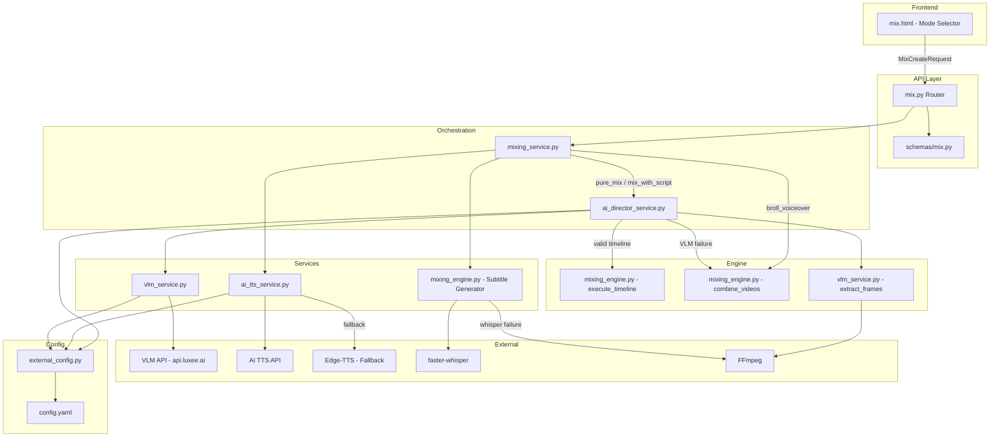
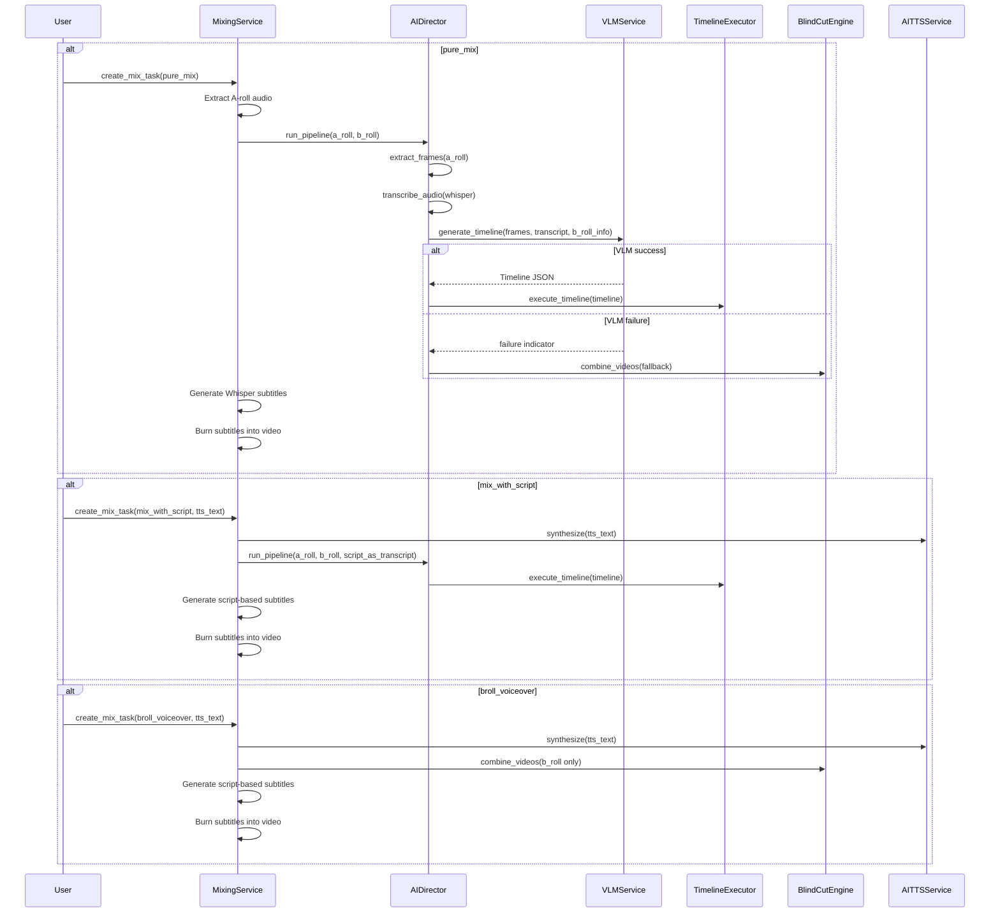

# Design Document: AI Director

## Overview

The AI Director module introduces VLM-powered intelligent video editing to XeEdio's video production platform. It replaces the current blind-cut mixing logic with a "decision-then-execution" architecture: extract frames from A-roll, send them to a Vision Language Model for semantic analysis, receive a JSON timeline, and execute precise cuts based on that timeline.

The module adds three new services (`ai_director_service.py`, `vlm_service.py`, `ai_tts_service.py`) and modifies existing files (`mixing_engine.py`, `mixing_service.py`, `schemas/mix.py`, `mix.html`, `external_config.py`) to support three mixing modes:

1. **Pure Mix** (`pure_mix`): A-roll + optional B-roll with original audio, AI-directed timeline, Whisper subtitles
2. **Mix with Script** (`mix_with_script`): A-roll + B-roll with AI TTS voiceover, AI-directed timeline, script-based subtitles
3. **B-roll Voiceover** (`broll_voiceover`): B-roll only with AI TTS voiceover, blind-cut arrangement, script-based subtitles

Every external dependency (VLM API, AI TTS API, Whisper ASR) has a graceful degradation path so video production never blocks on a single service failure.

## Architecture



### Pipeline Flow by Mode



## Components and Interfaces

### 1. VLM Service (`app/services/vlm_service.py`)

Handles frame extraction and VLM API communication.

```python
class VLMService:
    """VLM frame analysis and timeline generation service."""

    def __init__(self):
        self.config = ExternalConfig.get_instance()

    def extract_frames(
        self,
        video_path: str,
        frame_interval: float = 2.0,
        max_frames: int = 30,
        max_width: int = 512,
    ) -> list[tuple[float, str]]:
        """Extract frames from video using FFmpeg.

        Args:
            video_path: Path to A-roll video file.
            frame_interval: Seconds between frame extractions.
            max_frames: Maximum number of frames to extract.
            max_width: Maximum width for resized frames.

        Returns:
            List of (timestamp_seconds, base64_jpeg_string) tuples.

        Raises:
            FileNotFoundError: If video file doesn't exist.
            RuntimeError: If FFmpeg is unavailable or extraction fails.
        """

    def generate_timeline(
        self,
        frames: list[tuple[float, str]],
        transcript: str,
        b_roll_descriptions: list[dict],
        a_roll_duration: float,
    ) -> list[dict] | None:
        """Send frames to VLM API and get editing timeline.

        Args:
            frames: List of (timestamp, base64_image) from extract_frames.
            transcript: Audio transcript text for context.
            b_roll_descriptions: List of {"filename": str, "duration": float}.
            a_roll_duration: Total A-roll duration in seconds.

        Returns:
            List of timeline entry dicts, or None on failure (caller should fallback).
        """

    def validate_timeline(
        self,
        timeline: list[dict],
        a_roll_duration: float,
    ) -> bool:
        """Validate timeline JSON structure and constraints.

        Checks:
        - Non-empty array
        - Each entry has type, start, end, reason with correct types
        - type is "a_roll" or "b_roll"
        - start >= 0, end > start
        - Entries sorted by start, no overlaps

        Returns:
            True if valid, False otherwise (logs specific errors).
        """
```

### 2. AI Director Service (`app/services/ai_director_service.py`)

Orchestrates the full AI-directed editing pipeline.

```python
class AIDirectorService:
    """Orchestrates VLM analysis and timeline-based editing."""

    def __init__(self, task_id: str, output_dir: str):
        self.task_id = task_id
        self.output_dir = output_dir
        self.vlm_service = VLMService()

    def run_pipeline(
        self,
        a_roll_paths: list[str],
        b_roll_paths: list[str],
        transcript: str,
        aspect_ratio: str = "9:16",
        transition: str = "none",
        audio_file: str | None = None,
        progress_callback: callable | None = None,
    ) -> str:
        """Run the full AI Director pipeline.

        Steps:
        1. Extract frames from A-roll
        2. Send to VLM for timeline generation
        3. Execute timeline (or fallback to blind-cut)

        Args:
            a_roll_paths: A-roll video file paths.
            b_roll_paths: B-roll video file paths.
            transcript: Audio transcript or script text.
            aspect_ratio: Target aspect ratio.
            transition: Transition effect for B-roll.
            audio_file: Audio track to apply to final output.
            progress_callback: Callable(stage: str) for status updates.

        Returns:
            Path to the output video file.
        """

    def _transcribe_audio(self, audio_path: str) -> str:
        """Transcribe audio using Whisper ASR.

        Falls back to empty string if Whisper is unavailable.
        """
```

### 3. AI TTS Service (`app/services/ai_tts_service.py`)

Handles AI voiceover synthesis with Edge-TTS fallback.

```python
class AITTSService:
    """AI TTS synthesis with graceful degradation to Edge-TTS."""

    def __init__(self):
        self.config = ExternalConfig.get_instance()

    def synthesize(
        self,
        text: str,
        task_id: str,
        voice: str | None = None,
    ) -> tuple[str, float]:
        """Synthesize voiceover audio from text.

        Tries AI TTS API first, falls back to Edge-TTS if configured.

        Args:
            text: Script text to synthesize.
            task_id: Task ID for output path.
            voice: Optional voice name override.

        Returns:
            Tuple of (audio_file_path, duration_seconds).

        Raises:
            RuntimeError: If both AI TTS and fallback fail.
        """
```

### 4. Timeline Executor (`mixing_engine.py` — new function)

```python
def execute_timeline(
    timeline: list[dict],
    a_roll_paths: list[str],
    b_roll_paths: list[str],
    audio_file: str,
    output_path: str,
    video_aspect: str = "9:16",
    video_transition: str = "none",
    threads: int = 2,
) -> str:
    """Execute a VLM-generated timeline to produce the final video.

    Args:
        timeline: List of {"type", "start", "end", "reason"} dicts.
        a_roll_paths: A-roll video file paths.
        b_roll_paths: B-roll video file paths.
        audio_file: Audio track to apply.
        output_path: Output video file path.
        video_aspect: Target aspect ratio.
        video_transition: Transition effect for B-roll segments.
        threads: FFmpeg thread count.

    Returns:
        Path to the output video file.
    """
```

### 5. Schema Changes (`app/schemas/mix.py`)

```python
class MixCreateRequest(BaseModel):
    # ... existing fields ...
    mixing_mode: str = Field(
        default="pure_mix",
        pattern=r"^(pure_mix|mix_with_script|broll_voiceover)$",
        description="混剪模式：pure_mix | mix_with_script | broll_voiceover",
    )
```

### 6. ExternalConfig Extensions (`app/services/external_config.py`)

```python
def get_vlm_config(self) -> dict:
    """Get VLM configuration."""
    return {
        "api_url": self.get("vlm.api_url", ""),
        "api_key": self.get("vlm.api_key", ""),
        "model": self.get("vlm.model", "gpt-5.4"),
        "frame_interval": self.get("vlm.frame_interval", 2),
        "max_frames": self.get("vlm.max_frames", 30),
    }

def get_ai_tts_config(self) -> dict:
    """Get AI TTS configuration."""
    return {
        "api_url": self.get("ai_tts.api_url", ""),
        "api_key": self.get("ai_tts.api_key", ""),
        "fallback_to_edge_tts": self.get("ai_tts.fallback_to_edge_tts", True),
    }
```

### 7. Frontend Changes (`app/templates/mix.html`)

Add a mode selector in Step 3 (params configuration) with three radio-button options. Conditionally show/hide TTS text input and voice selector based on selected mode. When `broll_voiceover` is selected, skip Step 1 (A-roll selection) and start at Step 2. Include `mixing_mode` in the `MixCreateRequest` payload.

## Data Models

### Timeline Entry

```json
{
  "type": "a_roll",
  "start": 0.0,
  "end": 4.0,
  "reason": "Opening shot — talent introduces product, must stay on A-roll."
}
```

**Schema constraints:**
- `type`: string, one of `"a_roll"` or `"b_roll"`
- `start`: number, >= 0
- `end`: number, > `start`
- `reason`: string, non-empty
- Array must be sorted by `start`, no overlapping intervals

### MixCreateRequest Extension

The existing `MixCreateRequest` Pydantic model gains one new field:

| Field | Type | Default | Description |
|-------|------|---------|-------------|
| `mixing_mode` | `str` | `"pure_mix"` | One of `pure_mix`, `mix_with_script`, `broll_voiceover` |

Existing fields (`tts_text`, `tts_voice`, `a_roll_asset_ids`, `b_roll_asset_ids`) are reused with mode-specific validation in `MixingService`.

### MixStatusResponse Extension

The existing `progress` field is reused with new stage-specific strings:

| Stage | Progress Text |
|-------|--------------|
| Frame extraction | `"正在抽取关键帧…"` |
| VLM analysis | `"AI 编导分析中…"` |
| Timeline execution | `"正在执行智能剪辑…"` |
| Fallback activated | `"AI 编导不可用，使用传统混剪…"` |
| TTS synthesis | `"正在生成 AI 配音…"` |
| Subtitle generation | `"正在生成字幕…"` |

A new optional field `ai_director_used` (bool) indicates whether the final output used AI Director or fallback mode.

### config.yaml Sections

The `vlm` and `ai_tts` sections are already present in config.yaml. The `ExternalConfig` service reads them via dot-notation getters with hot-reload support (existing behavior — `get_instance()` always reloads from file).

## Correctness Properties

*A property is a characteristic or behavior that should hold true across all valid executions of a system — essentially, a formal statement about what the system should do. Properties serve as the bridge between human-readable specifications and machine-verifiable correctness guarantees.*

### Property 1: Frame extraction count and timestamp invariants

*For any* A-roll video with duration D seconds, frame interval I seconds, and max frames limit M, the Frame_Extractor SHALL return exactly `min(floor(D / I), M)` frames, each with a timestamp that is a non-negative multiple of I and less than D, and the list SHALL be sorted by timestamp in ascending order.

**Validates: Requirements 1.1, 1.4, 1.5**

### Property 2: Frame output format invariants

*For any* extracted frame from a video of arbitrary resolution, the output base64 string SHALL decode to valid JPEG image data, and the decoded image width SHALL be less than or equal to 512 pixels with the aspect ratio preserved (height/width ratio within 1% of the original).

**Validates: Requirements 1.2, 1.3**

### Property 3: Timeline JSON parsing round-trip

*For any* valid Timeline JSON array (where each entry has `type` ∈ {"a_roll", "b_roll"}, `start` ≥ 0, `end` > `start`, and `reason` is a non-empty string, entries sorted by `start` with no overlaps), serializing to a JSON string and then parsing back through the VLM_Service parser SHALL produce an equivalent list of Timeline objects with all field values preserved.

**Validates: Requirements 2.3, 11.1, 11.2, 11.3**

### Property 4: Timeline validation accepts valid and rejects invalid

*For any* list of timeline entry dicts, the `validate_timeline` function SHALL return True if and only if: the list is non-empty, every entry has fields `type` (string ∈ {"a_roll", "b_roll"}), `start` (number ≥ 0), `end` (number > start), and `reason` (string); and entries are sorted by `start` with no overlapping intervals (entry[i].end ≤ entry[i+1].start).

**Validates: Requirements 2.4, 11.1, 11.2, 11.3, 11.4, 11.5**

### Property 5: B-roll round-robin cycling

*For any* B-roll pool of size N (N ≥ 1) and any number of B-roll timeline entries K, the Timeline_Executor SHALL assign B-roll clips in a repeating cycle such that entry i uses B-roll clip at index `i % N`, ensuring every clip is used before any clip is reused.

**Validates: Requirements 3.3**

### Property 6: Script-to-subtitle coverage

*For any* non-empty script text and positive TTS audio duration, the generated ASS subtitle segments SHALL collectively cover the full audio duration (first segment starts at 0, last segment ends at or near the audio duration), and the concatenation of all segment texts SHALL contain all words from the original script.

**Validates: Requirements 7.2**

### Property 7: Mixing mode input validation

*For any* `MixCreateRequest` where: (a) `mixing_mode` is `pure_mix` and `a_roll_asset_ids` is empty, OR (b) `mixing_mode` is `broll_voiceover` and `b_roll_asset_ids` is empty, OR (c) `mixing_mode` is `broll_voiceover` and `tts_text` is empty or None — the MixingService SHALL reject the request with a validation error before starting any processing.

**Validates: Requirements 5.6, 5.7, 5.8**

## Error Handling

### Graceful Degradation Chain

Each external dependency has a defined fallback:

| Service | Primary | Fallback | Trigger |
|---------|---------|----------|---------|
| VLM API | `vlm_service.generate_timeline()` | `combine_videos()` (blind-cut) | API timeout (60s + 1 retry), HTTP error, invalid JSON, empty `vlm.api_key` |
| AI TTS API | External AI TTS endpoint | Edge-TTS (`edge_tts.Communicate`) | API failure + `ai_tts.fallback_to_edge_tts: true` |
| Whisper ASR | `faster-whisper` model | FFmpeg `silencedetect` | Model load failure, import error |

### Error Propagation

- **VLM failure**: `VLMService.generate_timeline()` returns `None`. `AIDirectorService` catches this and calls `combine_videos()` instead. Task progress updates to `"AI 编导不可用，使用传统混剪…"`. The task completes successfully with `ai_director_used: false`.

- **AI TTS failure**: `AITTSService.synthesize()` tries the external API first. On failure, if `fallback_to_edge_tts` is true, it calls Edge-TTS. If fallback is also disabled, it raises `RuntimeError`, which `MixingService.execute_mix()` catches and marks the task as `"failed"`.

- **Whisper failure**: `_generate_subtitles()` catches the import/model error and falls back to `_detect_speech_segments()` (FFmpeg silence detection). If silence detection also fails, subtitles are skipped (video still produced, just without subtitles).

- **Timeline validation failure**: `validate_timeline()` returns `False` with logged details. `VLMService.generate_timeline()` returns `None`, triggering the blind-cut fallback.

- **FFmpeg unavailable**: `extract_frames()` raises `RuntimeError("FFmpeg is required")`. This propagates up and the task is marked as `"failed"` — FFmpeg is a hard dependency with no fallback.

### Logging Strategy

All fallback activations log at WARNING level with the pattern:
```
WARNING - {service} unavailable ({error_detail}), falling back to {fallback_mechanism}
```

All API errors log at ERROR level with request/response details (excluding API keys).

## Testing Strategy

### Unit Tests

Unit tests cover specific examples, edge cases, and integration points:

- **Frame extraction edge cases**: Zero-duration video, unreadable file, missing FFmpeg
- **VLM API mocking**: Timeout behavior (retry once then fail), HTTP 4xx/5xx responses, malformed JSON responses
- **AI TTS fallback chain**: AI TTS success, AI TTS failure + Edge-TTS fallback, both fail
- **Mode routing**: Each mixing mode invokes the correct pipeline components
- **Subtitle generation**: ASS format correctness, font size scaling with resolution
- **Config getters**: `get_vlm_config()` and `get_ai_tts_config()` return correct values
- **Timeline clamping**: Timeline entries beyond A-roll duration are clamped

### Property-Based Tests

Property-based tests verify universal properties across generated inputs. The project uses **Hypothesis** (Python PBT library) with a minimum of 100 iterations per property.

Each property test is tagged with:
```python
# Feature: ai-director, Property {N}: {property_text}
```

**Properties to implement:**
1. Frame extraction count/timestamp invariants
2. Frame output format (resize + base64 JPEG validity)
3. Timeline JSON parsing round-trip
4. Timeline validation (valid accepted, invalid rejected)
5. B-roll round-robin cycling
6. Script-to-subtitle coverage
7. Mixing mode input validation

### Integration Tests

Integration tests verify end-to-end behavior with real (small) video files:

- Full `pure_mix` pipeline with mocked VLM returning a valid timeline
- Full `broll_voiceover` pipeline producing output video
- Graceful degradation: VLM mock returning failure triggers blind-cut fallback
- Subtitle burning into final video output
