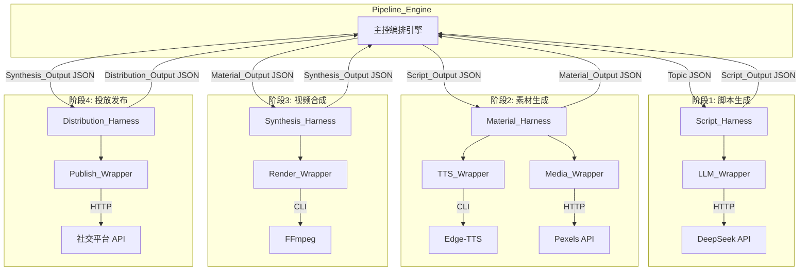
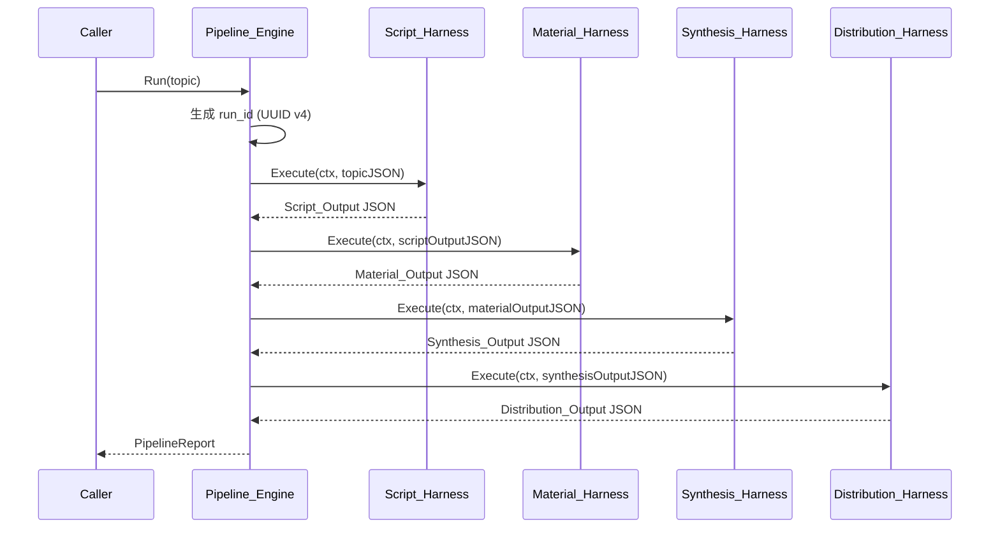

# 技术设计文档：AI 短视频全链路自动化管线

## Overview

本系统是一个基于 Go 语言的 AI 短视频全链路自动化管线。系统采用 Harness 模式（包裹器/接口模式），将视频生产流程划分为 4 个强隔离阶段：

1. **脚本生成**（Script_Harness）— 调用 DeepSeek LLM 生成分镜词和口播稿
2. **素材生成**（Material_Harness）— 并行调用 Edge-TTS 和 Pexels API 生成音频与空镜素材
3. **视频合成**（Synthesis_Harness）— 调用 FFmpeg 子进程合成 MP4 成片
4. **投放发布**（Distribution_Harness）— 调用目标平台 API 发布视频

主控编排引擎（Pipeline_Engine）负责按顺序调度各阶段 Harness，将上一阶段的标准化 JSON 输出作为下一阶段的输入传递。每个 Harness 内部封装了对外部服务的调用，并提供统一的重试、超时和降级能力。

### 设计目标

- 阶段间强隔离：每个 Harness 通过 `[]byte` JSON 通信，互不依赖内部实现
- 可观测性：每次执行生成唯一 run_id，结构化日志记录各阶段耗时和状态
- 弹性：统一的重试/超时/降级策略，外部服务故障不会导致整个管线崩溃
- 可配置：所有外部服务参数和运行策略通过 YAML + 环境变量管理

### 技术选型

| 组件 | 技术 | 说明 |
|------|------|------|
| 语言 | Go 1.22+ | 并发模型天然适合管线编排 |
| LLM | DeepSeek API | 脚本生成，HTTP JSON API |
| TTS | Edge-TTS (CLI) | 微软语音合成，通过命令行调用 |
| 素材 | Pexels API | 免费无版权视频素材库 |
| 渲染 | FFmpeg (CLI) | 视频合成，通过 exec.Command 调用 |
| 配置 | gopkg.in/yaml.v3 | YAML 配置文件解析 |
| UUID | github.com/google/uuid | run_id 生成 |
| 日志 | log/slog (标准库) | Go 1.21+ 结构化日志 |
| 测试 | testing + rapid | pgregory.net/rapid 属性测试库 |

## Architecture

### 系统架构图



### 执行流程



### 项目目录结构

```
ai-video-pipeline/
├── cmd/
│   └── pipeline/
│       └── main.go              # 入口，加载配置并启动管线
├── internal/
│   ├── config/
│   │   └── config.go            # 配置加载（YAML + 环境变量）
│   ├── engine/
│   │   └── engine.go            # Pipeline_Engine 编排逻辑
│   ├── harness/
│   │   ├── harness.go           # Harness 接口定义 + 基础实现
│   │   ├── script.go            # Script_Harness
│   │   ├── material.go          # Material_Harness
│   │   ├── synthesis.go         # Synthesis_Harness
│   │   └── distribution.go      # Distribution_Harness
│   ├── wrapper/
│   │   ├── llm.go               # LLM_Wrapper (DeepSeek)
│   │   ├── tts.go               # TTS_Wrapper (Edge-TTS)
│   │   ├── media.go             # Media_Wrapper (Pexels)
│   │   ├── render.go            # Render_Wrapper (FFmpeg)
│   │   └── publish.go           # Publish_Wrapper (平台发布)
│   └── model/
│       └── model.go             # 数据模型定义
├── config.yaml                  # 默认配置文件
├── go.mod
└── go.sum
```


## Components and Interfaces

### 1. Harness 接口（核心抽象）

所有阶段 Harness 实现统一接口：

```go
// Harness 定义了管线阶段的标准化执行接口
type Harness interface {
    // Name 返回 Harness 名称，用于日志和错误报告
    Name() string
    // Execute 执行阶段逻辑，接收 JSON 输入，返回 JSON 输出
    Execute(ctx context.Context, input []byte) (output []byte, err error)
}
```

### 2. BaseHarness（基础实现）

提供重试、超时、降级和日志的通用逻辑，各阶段 Harness 通过组合 BaseHarness 获得这些能力：

```go
type RetryConfig struct {
    MaxRetries    int           // 最大重试次数
    RetryInterval time.Duration // 重试间隔
    Timeout       time.Duration // 单次调用超时
}

type BaseHarness struct {
    name        string
    retryConfig RetryConfig
    logger      *slog.Logger
}

// ExecuteWithRetry 封装重试/超时/降级逻辑
// fn 是实际的业务逻辑函数
// fallback 是降级函数，当重试耗尽时调用（可为 nil）
func (b *BaseHarness) ExecuteWithRetry(
    ctx context.Context,
    fn func(ctx context.Context) ([]byte, error),
    fallback func(ctx context.Context) ([]byte, error),
) ([]byte, error)
```

### 3. Pipeline_Engine

```go
type PipelineEngine struct {
    stages []Harness // 按顺序排列的 4 个阶段
    logger *slog.Logger
}

type StageResult struct {
    StageName string        `json:"stage_name"`
    Status    string        `json:"status"`    // "success" | "failed" | "skipped"
    Duration  int64         `json:"duration_ms"`
    Error     string        `json:"error,omitempty"`
}

type PipelineReport struct {
    RunID   string        `json:"run_id"`
    Topic   string        `json:"topic"`
    Stages  []StageResult `json:"stages"`
    Status  string        `json:"status"`  // "success" | "failed"
    Total   int64         `json:"total_ms"`
}

// Run 执行完整管线，返回执行报告
func (e *PipelineEngine) Run(ctx context.Context, topic string) PipelineReport
```

### 4. Script_Harness

内部组合 BaseHarness + LLM_Wrapper：

```go
type ScriptHarness struct {
    BaseHarness
    llm *LLMWrapper
}

// Execute 接收 topic JSON，返回 Script_Output JSON
// 内部流程：调用 LLM → 解析响应 → 校验 scenes/narrations 长度一致 → 返回
// 解析失败时附加格式纠正指令重新调用
func (s *ScriptHarness) Execute(ctx context.Context, input []byte) ([]byte, error)
```

LLM_Wrapper 接口：

```go
type LLMWrapper struct {
    apiKey   string
    endpoint string
    client   *http.Client
}

// Generate 调用 DeepSeek API，返回原始文本响应
func (l *LLMWrapper) Generate(ctx context.Context, systemPrompt, userPrompt string) (string, error)
```

### 5. Material_Harness

内部组合 BaseHarness + TTS_Wrapper + Media_Wrapper，并行执行两个子任务：

```go
type MaterialHarness struct {
    BaseHarness
    tts   *TTSWrapper
    media *MediaWrapper
}

// Execute 接收 Script_Output JSON，并行生成音频和空镜，返回 Material_Output JSON
func (m *MaterialHarness) Execute(ctx context.Context, input []byte) ([]byte, error)
```

TTS_Wrapper：

```go
type TTSWrapper struct {
    voice    string // Edge-TTS 语音名称
    outputDir string
}

// Synthesize 为单条 narration 生成 MP3 文件，返回文件绝对路径
func (t *TTSWrapper) Synthesize(ctx context.Context, sceneID int, text string) (string, error)
```

Media_Wrapper：

```go
type MediaWrapper struct {
    apiKey    string
    outputDir string
    client    *http.Client
}

// Search 根据描述搜索并下载 Pexels 视频素材，返回文件绝对路径
func (m *MediaWrapper) Search(ctx context.Context, sceneID int, description string) (string, error)
```

### 6. Synthesis_Harness

内部组合 BaseHarness + Render_Wrapper：

```go
type SynthesisHarness struct {
    BaseHarness
    render *RenderWrapper
}

// Execute 接收 Material_Output JSON，调用 FFmpeg 合成视频，返回 Synthesis_Output JSON
func (s *SynthesisHarness) Execute(ctx context.Context, input []byte) ([]byte, error)
```

Render_Wrapper：

```go
type RenderWrapper struct {
    ffmpegPath string
    outputDir  string
}

// Render 构建 FFmpeg 命令并执行，返回输出 MP4 文件路径
// 执行前校验所有输入文件存在性
func (r *RenderWrapper) Render(ctx context.Context, audioPaths, videoPaths []string) (string, error)
```

### 7. Distribution_Harness

内部组合 BaseHarness + Publish_Wrapper（通过接口支持多平台）：

```go
// Publisher 定义发布接口，不同平台实现此接口
type Publisher interface {
    Publish(ctx context.Context, videoPath string, title string) (publishURL string, err error)
}

type DistributionHarness struct {
    BaseHarness
    publisher Publisher
}

// Execute 接收 Synthesis_Output JSON + 标题，发布视频，返回 Distribution_Output JSON
func (d *DistributionHarness) Execute(ctx context.Context, input []byte) ([]byte, error)
```

### 8. Config

```go
type Config struct {
    DeepSeek   DeepSeekConfig   `yaml:"deepseek"`
    EdgeTTS    EdgeTTSConfig    `yaml:"edge_tts"`
    Pexels     PexelsConfig     `yaml:"pexels"`
    FFmpeg     FFmpegConfig     `yaml:"ffmpeg"`
    Publish    PublishConfig    `yaml:"publish"`
    Harnesses  HarnessesConfig  `yaml:"harnesses"`
}

type DeepSeekConfig struct {
    APIKey   string `yaml:"api_key"`
    Endpoint string `yaml:"endpoint"`
    Timeout  int    `yaml:"timeout_seconds"`
}

// ... 其他配置结构类似

type HarnessRetryConfig struct {
    MaxRetries    int `yaml:"max_retries"`
    RetryInterval int `yaml:"retry_interval_ms"`
    Timeout       int `yaml:"timeout_seconds"`
}

// Load 从 YAML 文件加载配置，环境变量覆盖同名参数
// 缺失必要参数时返回包含缺失项名称列表的 error
func Load(path string) (*Config, error)
```

## Data Models

### Script_Output（阶段 1 输出）

```go
type Scene struct {
    SceneID     int    `json:"scene_id"`
    Description string `json:"description"`
}

type Narration struct {
    SceneID int    `json:"scene_id"`
    Text    string `json:"text"`
}

type ScriptOutput struct {
    Scenes     []Scene     `json:"scenes"`
    Narrations []Narration `json:"narrations"`
}
```

JSON 示例：
```json
{
  "scenes": [
    {"scene_id": 1, "description": "城市天际线日出延时"},
    {"scene_id": 2, "description": "咖啡馆内部特写"}
  ],
  "narrations": [
    {"scene_id": 1, "text": "每一天的开始，都是一次新的可能"},
    {"scene_id": 2, "text": "一杯咖啡，开启美好的一天"}
  ]
}
```

### Material_Output（阶段 2 输出）

```go
type MaterialOutput struct {
    AudioPaths []string `json:"audio_paths"`
    VideoPaths []string `json:"video_paths"`
}
```

### Synthesis_Output（阶段 3 输出）

```go
type SynthesisOutput struct {
    VideoPath string `json:"video_path"`
}
```

### Distribution_Output（阶段 4 输出）

```go
type DistributionOutput struct {
    Status     string `json:"status"`      // "success" | "failed"
    PublishURL string `json:"publish_url,omitempty"`
    Error      string `json:"error_message,omitempty"`
}
```

### PipelineInput（管线输入）

```go
type PipelineInput struct {
    Topic string `json:"topic"`
    Title string `json:"title,omitempty"` // 可选，用于发布阶段的视频标题
}
```


## Correctness Properties

*A property is a characteristic or behavior that should hold true across all valid executions of a system—essentially, a formal statement about what the system should do. Properties serve as the bridge between human-readable specifications and machine-verifiable correctness guarantees.*

### Property 1: 无效 JSON 输入被拒绝

*For any* Harness 实现和任意非法 JSON 字节流（包括空字节、截断 JSON、非 JSON 文本），调用 Execute 时应返回非 nil 错误，且错误信息中包含输入校验失败的原因。

**Validates: Requirements 1.2**

### Property 2: 重试与降级行为一致性

*For any* Harness 配置（最大重试次数 N ≥ 1、重试间隔 > 0）和一个总是失败的外部服务调用，Harness 应恰好调用外部服务 N+1 次（1 次初始 + N 次重试），且最终执行降级函数（如果配置了降级）或返回包含最终错误信息的失败状态。

**Validates: Requirements 1.3, 1.5**

### Property 3: 超时中断

*For any* Harness 配置（超时阈值 T > 0）和一个响应时间超过 T 的外部服务调用，Harness 应在不超过 T + 合理误差 的时间内返回超时错误。

**Validates: Requirements 1.4**

### Property 4: 管线顺序执行与数据传递

*For any* 主题字符串和 4 个 mock Harness（各自返回确定性输出），Pipeline_Engine 应按 Script → Material → Synthesis → Distribution 的顺序调用它们，且每个阶段收到的输入等于上一阶段的输出（第一阶段收到的输入包含原始主题）。

**Validates: Requirements 2.1, 2.2**

### Property 5: 管线错误传播与停止

*For any* 失败阶段位置 i ∈ {1,2,3,4} 和任意错误信息，当第 i 个阶段返回错误时，Pipeline_Engine 应不调用第 i+1 及之后的阶段，且返回的 PipelineReport 中包含失败阶段的名称和错误信息。

**Validates: Requirements 2.3**

### Property 6: PipelineReport 完整性

*For any* 管线执行（无论成功或在第 i 阶段失败），返回的 PipelineReport 应包含所有已执行阶段的 StageResult（含 stage_name、status、duration_ms），且未执行阶段的 status 为 "skipped"。

**Validates: Requirements 2.4**

### Property 7: run_id 唯一性与格式

*For any* 两次独立的管线执行，生成的 run_id 应互不相同，且每个 run_id 符合 UUID v4 格式（8-4-4-4-12 十六进制字符，版本位为 4）。

**Validates: Requirements 2.5**

### Property 8: ScriptOutput 校验

*For any* ScriptOutput 实例，校验函数应满足：当 scenes 和 narrations 长度一致且均大于 0，且每个 scene_id 为正整数、description 非空、每个 narration 的 scene_id 为正整数、text 非空时，校验通过；否则校验失败并返回具体原因。

**Validates: Requirements 3.3, 3.6**

### Property 9: Wrapper 输出按 scene_id 排序

*For any* 随机顺序的 narrations 列表或 scenes 列表，TTS_Wrapper 和 Media_Wrapper 返回的文件路径列表应按对应的 scene_id 升序排列。

**Validates: Requirements 4.3, 4.5**

### Property 10: Material_Output 合并正确性

*For any* TTS_Wrapper 返回的音频路径列表 A 和 Media_Wrapper 返回的视频路径列表 V，Material_Harness 合并后的 Material_Output 应满足 audio_paths == A 且 video_paths == V。

**Validates: Requirements 4.6**

### Property 11: 部分失败处理

*For any* Material_Harness 执行中，当 TTS_Wrapper 或 Media_Wrapper 中恰好一个返回错误时，Material_Harness 应返回包含失败子任务名称的错误信息，同时保留成功子任务的部分结果。

**Validates: Requirements 4.7**

### Property 12: FFmpeg 命令构建

*For any* 非空的 audio_paths 列表和 video_paths 列表，Render_Wrapper 构建的 FFmpeg 命令行参数应包含所有输入文件路径，且输出文件路径以 .mp4 结尾。

**Validates: Requirements 5.1**

### Property 13: 文件存在性校验

*For any* 文件路径列表（部分路径指向存在的文件，部分指向不存在的文件），校验函数应返回所有不存在的文件路径集合。当所有文件都存在时，校验通过。当存在缺失文件时，返回的错误信息包含所有缺失文件的路径。

**Validates: Requirements 5.5, 6.4**

### Property 14: 数据模型序列化往返一致性

*For any* 有效的 ScriptOutput、MaterialOutput、SynthesisOutput 或 DistributionOutput 实例，Marshal 为 JSON 字节流后再 Unmarshal 回 struct，应与原始实例深度相等。

**Validates: Requirements 7.4**

### Property 15: 反序列化校验错误

*For any* 不符合数据模型结构的 JSON 字节流（如缺失必要字段、字段类型错误），Unmarshal 应返回非 nil 错误，且错误信息中包含具体的字段名称和错误原因。

**Validates: Requirements 7.5**

### Property 16: 配置加载往返一致性

*For any* 有效的 Config 实例，将其序列化为 YAML 文件后通过 Load 函数加载，得到的 Config 应与原始实例深度相等。

**Validates: Requirements 8.1, 8.2**

### Property 17: 配置缺失参数校验

*For any* 缺失至少一个必要参数的 YAML 配置内容，Load 函数应返回非 nil 错误，且错误信息中包含所有缺失参数的名称。

**Validates: Requirements 8.3**

### Property 18: 环境变量覆盖配置

*For any* 配置参数名称和两个不同的值（一个在 YAML 文件中，一个在环境变量中），Load 函数加载后该参数的值应等于环境变量中的值。

**Validates: Requirements 8.4**


## Error Handling

### 错误分类

| 错误类型 | 来源 | 处理策略 |
|---------|------|---------|
| 输入校验错误 | JSON 格式错误、字段缺失 | 立即返回，不重试 |
| 外部服务暂时性错误 | HTTP 5xx、网络超时、连接拒绝 | 按配置重试 |
| 外部服务永久性错误 | HTTP 4xx（认证失败、参数错误） | 立即返回，不重试 |
| 超时错误 | context.DeadlineExceeded | 中断当前调用，返回超时错误 |
| 子进程错误 | FFmpeg 非零退出码 | 捕获 stderr，返回错误详情 |
| 文件系统错误 | 文件不存在、权限不足 | 立即返回，包含文件路径 |
| 配置错误 | 缺失必要参数 | 启动时终止，输出缺失项列表 |

### 错误传播机制

1. **Wrapper 层**：捕获外部调用的原始错误，包装为带上下文的 `fmt.Errorf("wrapper_name: %w", err)`
2. **Harness 层**：BaseHarness 的 ExecuteWithRetry 处理重试/超时/降级逻辑，最终错误包含重试次数和最后一次错误
3. **Engine 层**：Pipeline_Engine 捕获 Harness 错误，记录失败阶段名称，停止后续阶段，写入 PipelineReport

### 降级策略

各阶段的降级策略由配置决定，默认行为：

- **Script_Harness**：无降级，LLM 生成失败则管线终止
- **Material_Harness**：TTS 或 Media 单个子任务失败时返回部分结果和错误信息，由 Engine 决定是否继续
- **Synthesis_Harness**：无降级，FFmpeg 合成失败则管线终止
- **Distribution_Harness**：发布失败返回 failed 状态，管线仍视为完成（视频已生成）

## Testing Strategy

### 测试框架

- **单元测试**：Go 标准库 `testing`
- **属性测试**：`pgregory.net/rapid`（Go 语言属性测试库）
- **Mock**：通过接口注入实现 mock，不依赖额外 mock 框架

### 属性测试配置

- 每个属性测试最少运行 100 次迭代
- 每个属性测试必须通过注释引用设计文档中的属性编号
- 注释格式：`// Feature: ai-video-pipeline, Property {N}: {property_text}`

### 测试分层

#### 属性测试（Property-Based Tests）

覆盖设计文档中的 18 个 Correctness Properties，使用 `rapid` 库生成随机输入：

| 属性 | 测试文件 | 生成器 |
|------|---------|--------|
| P1: 无效 JSON 输入 | `harness/harness_test.go` | rapid.SliceOf(rapid.Byte()) 生成随机字节流 |
| P2: 重试与降级 | `harness/harness_test.go` | rapid.IntRange(1,5) 生成重试次数 |
| P3: 超时中断 | `harness/harness_test.go` | rapid.IntRange(100,2000) 生成超时毫秒数 |
| P4: 管线顺序执行 | `engine/engine_test.go` | rapid.String() 生成随机主题 |
| P5: 管线错误传播 | `engine/engine_test.go` | rapid.IntRange(0,3) 生成失败阶段索引 |
| P6: PipelineReport 完整性 | `engine/engine_test.go` | 复用 P4/P5 的生成器 |
| P7: run_id 唯一性 | `engine/engine_test.go` | 多次执行收集 run_id |
| P8: ScriptOutput 校验 | `model/model_test.go` | 生成随机 ScriptOutput（含合法和非法实例） |
| P9: 输出排序 | `wrapper/wrapper_test.go` | rapid.Permutation 生成随机顺序的 scene 列表 |
| P10: Material 合并 | `harness/material_test.go` | 生成随机路径列表 |
| P11: 部分失败 | `harness/material_test.go` | rapid.Bool() 决定哪个 wrapper 失败 |
| P12: FFmpeg 命令构建 | `wrapper/render_test.go` | 生成随机文件路径列表 |
| P13: 文件存在性校验 | `wrapper/render_test.go` | 生成随机路径（部分存在部分不存在） |
| P14: 序列化往返 | `model/model_test.go` | 生成随机有效的各阶段输出 struct |
| P15: 反序列化校验 | `model/model_test.go` | 生成随机非法 JSON |
| P16: 配置加载往返 | `config/config_test.go` | 生成随机有效 Config |
| P17: 配置缺失校验 | `config/config_test.go` | 生成随机不完整配置 |
| P18: 环境变量覆盖 | `config/config_test.go` | 生成随机参数名和值 |

#### 单元测试（Unit Tests）

覆盖具体示例、边界情况和集成点：

- **Harness 日志记录**（1.6）：验证执行后日志包含输入摘要、输出摘要、耗时和状态
- **LLM 响应解析失败重试**（3.4）：mock LLM 第一次返回非法格式，验证第二次调用包含格式纠正指令
- **并行执行验证**（4.1）：mock TTS 和 Media wrapper，验证两者都被调用
- **FFmpeg 成功路径**（5.3）：mock FFmpeg 返回退出码 0，验证返回 MP4 路径
- **FFmpeg 失败路径**（5.4）：mock FFmpeg 返回非零退出码，验证错误包含 stderr
- **发布成功/失败**（6.2, 6.3）：mock Publisher，验证 Distribution_Output 的 status 和 publish_url/error_message
- **平台选择**（6.5）：配置不同平台名称，验证选择正确的 Publisher 实现

### Mock 策略

所有外部依赖通过接口注入，测试时替换为 mock 实现：

```go
// 示例：mock LLM_Wrapper
type mockLLM struct {
    responses []string // 按调用顺序返回
    callCount int
}

func (m *mockLLM) Generate(ctx context.Context, system, user string) (string, error) {
    if m.callCount >= len(m.responses) {
        return "", fmt.Errorf("no more responses")
    }
    resp := m.responses[m.callCount]
    m.callCount++
    return resp, nil
}
```

### 测试运行

```bash
# 运行所有测试
go test ./...

# 运行属性测试（verbose，显示迭代次数）
go test -v -run TestProperty ./...

# 运行单元测试
go test -v -run TestUnit ./...
```
