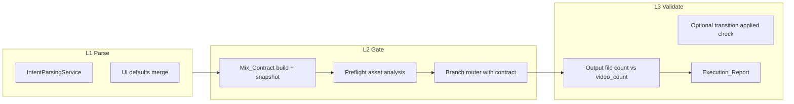

# Design: Intent–Execution Contract & Mix Integrity

## 1. Goals

1. **Close the intent loop**: Every field in `Mix_Contract` is either applied on the active branch or causes a documented failure—no silent drops (especially `video_count` on Montage_Path).
2. **Lift editing semantics** from prose-only to structured + prose: transitions, anchors, exclusions, pacing—fed to VLM/LLM as a deterministic JSON adjunct.
3. **Stabilize asset intelligence UX**: Preflight visibility, warnings, and optional sync lightweight analysis for gaps—so “library as memory” fails loudly instead of quietly degrading.

## 2. Architecture: Three Layers



## 3. Data Model

### 3.1 Mix_Contract (embedded in `mix_params`)

Recommended shape (JSON fragment inside existing `mix_params` text/json):

```json
{
  "mix_contract": {
    "contract_version": 1,
    "video_count": 3,
    "max_output_duration": 35,
    "aspect_ratio": "9:16",
    "transition": "fade_in",
    "strip_audio": false,
    "anchor_asset_ids": ["uuid-a", "uuid-b"],
    "exclude_asset_ids": [],
    "pacing": "normal",
    "director_prompt": "…"
  }
}
```

- **contract_version**: Bump when semantics change.
- **anchor_asset_ids**: Ordered; mapped to `clip_paths` indices at execution time; invalid IDs → L2 error or strip with warning (product choice; spec recommends **fail** if any anchor not in task set).

Legacy tasks: if `mix_contract` absent, build in code from flat `video_count`, `transition`, etc.

### 3.2 Execution_Report

Stored in `mix_params` post-run or in task log file:

```json
{
  "execution_report": {
    "outputs": ["output-1.mp4", "output-2.mp4"],
    "durations_sec": [34.0, 35.1],
    "contract_validation": "pass",
    "warnings": ["clip_3 used fallback frames"]
  }
}
```

## 4. Service Changes

### 4.1 MixingService (`mixing_service.py`)

1. After `IntentParsingService.merge_with_ui_defaults`, build **`mix_contract`** object (subset + version) and attach to `mix_params`.
2. On `execute_mix`, read `mix_contract` and pass **explicit kwargs** into `AIDirectorService` (`video_count`, `transition`, `asset_ids`, anchor/exclude maps).
3. After AI Director returns, run **L3**: count `output-*.mp4` with size > 0; compare to `video_count`; set task failed + message on mismatch.
4. **Preflight** (optional in Phase 1b): before starting heavy work, query `AssetAnalysisService` for statuses; append warnings to task or return on create—align with `requirements.md` policy.

### 4.2 AIDirectorService (`ai_director_service.py`)

1. **`run_auto_pipeline`**: Always pass `asset_ids` into `run_montage_pipeline`. Pass `video_count` from contract (default 1).
2. **`run_montage_pipeline`**: Add parameters `video_count: int = 1`, keep `asset_ids`.
3. **Multi-output montage (MVP implementation path)** — **Strategy A** (sequential):
   - For `k` in `1..video_count`: build `user_prompt_suffix` = contract snippet + “This is output k of N; target length ≈ T; vary structure from previous outputs.”
   - Call existing `generate_montage_timeline` (or unified timeline) per k; execute to `output-k.mp4`.
   - Short-circuit: if any iteration returns no timeline, either retry once with stricter prompt or fail entire task (configurable; default **fail** to satisfy contract).
4. **Anchor enforcement (MVP)**:
   - After VLM returns timeline entries, **prepend** or **reorder** first segments so that `anchor_asset_ids` order appears at t=0 (simple deterministic splice), then optionally re-run snap; or inject hard constraints into VLM user message listing `clip_index` mapping table (`clip_0 = <display_name>`).
5. **Exclude**: Filter any timeline entry whose `clip_index` maps to an excluded asset id before execution.

### 4.3 IntentParsingService (`intent_parsing_service.py`)

1. Extend `ParsedIntent` + system prompt + `_validate_and_clamp` for: `transition` (enum aligned with `mix` schema), `anchor_asset_ids`, `exclude_asset_ids`, `pacing`.
2. Note: extracting **asset UUIDs** from prose is unreliable unless the user names them; MVP may leave lists empty unless UI sends explicit selection. Parser can still extract **transition words** and **pacing adjectives**.

### 4.4 Schemas (`schemas/mix.py`)

1. Document `mix_contract` and optional `execution_report` on task-related responses if exposed.
2. Ensure `transition` enum in `MixCreateRequest` matches executor.

## 5. API Surface

| Endpoint / behavior | Change |
|---------------------|--------|
| `POST /api/mix/create` | Response may include `preflight` / `warnings` array (Phase 1b). |
| `POST /api/mix/parse-intent` | Extend response model with new optional fields for preview. |

## 6. Logging

- At start of `run_auto_pipeline` / `run_montage_pipeline`: log `mix_contract` keys (truncate prompt).
- After L3: log `contract_validation` outcome.

## 7. Risks & Mitigations

| Risk | Mitigation |
|------|------------|
| Sequential N VLM calls = N× cost/latency | Document in UI; Phase 2 single-call multi-index timeline. |
| Anchor reorder breaks snap | Run snap after mechanical prepend; clamp durations. |
| Parser invents wrong UUIDs | Only populate anchors from UI-selected ids; NL only for transition/pacing. |

## 8. Relation to Other Specs

- **natural-language-intent-parsing**: Extends `ParsedIntent`; merge order unchanged.
- **vlm-driven-mixing**: Aligns execution with “unified timeline” vision; montage multi-output was a documented gap.
- **ai-director**: Supersedes implicit assumption that montage is always single-file.

## 9. Open Questions

1. Default when `video_count > 1` and VLM fails on iteration 2: fail whole task vs deliver partial (product).
2. Whether `preflight` blocks create for paid tiers only—ops policy.
