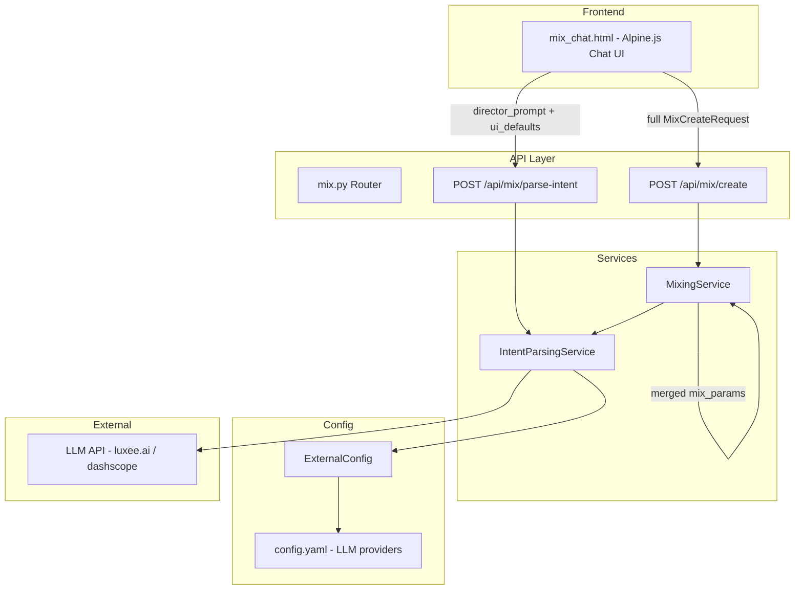
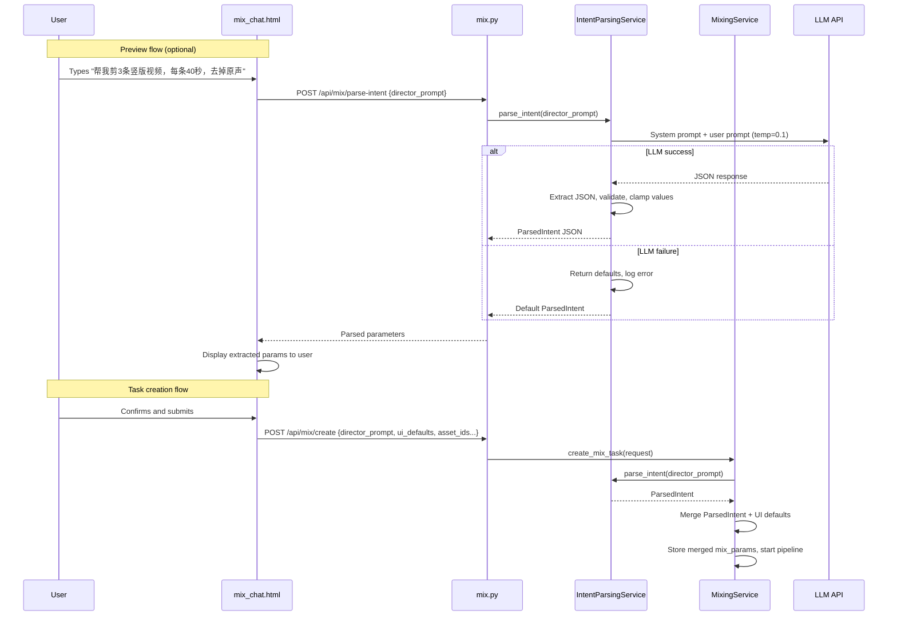

# Design Document: Natural Language Intent Parsing

## Overview

The Natural Language Intent Parsing feature adds an LLM-powered parameter extraction layer to XeEdio's video mixing pipeline. Currently, the frontend `mix_chat.html` uses brittle regex patterns (`minMatch`, `secMatch`, `countMatch`) to extract duration and count from user input, while other parameters (font, subtitles, TTS, aspect ratio, audio stripping) require manual UI panel configuration. The `director_prompt` is passed raw to the VLM/LLM without structured extraction.

This feature introduces an `IntentParsingService` that intercepts the user's natural language input, calls the configured LLM provider (default: gpt-5.4 via luxee.ai) to extract structured mixing parameters as JSON, applies sensible defaults for unspecified parameters, and merges the result with UI panel settings (LLM-extracted values take priority). A dedicated `POST /api/mix/parse-intent` endpoint allows the frontend to preview extracted parameters before task creation.

Key design decisions:
- **Backend-only parsing**: All parameter extraction moves to the backend `IntentParsingService`, eliminating frontend regex entirely
- **LLM with low temperature**: Temperature set to 0.1 for consistent JSON output
- **Graceful degradation**: LLM failures return default parameters; mixing never blocks on parsing errors
- **Merge strategy**: `Parsed_Intent > UI_Panel_Defaults > System_Defaults` priority chain
- **Reuse existing config pattern**: Follows `TextDrivenEditingService._get_llm_config()` pattern for LLM provider resolution

## Architecture



### Request Flow



## Components and Interfaces

### 1. IntentParsingService (`app/services/intent_parsing_service.py`)

Core service responsible for LLM-based parameter extraction.

```python
from dataclasses import dataclass, field, asdict
from typing import Optional
import json
import logging
import httpx

from app.services.external_config import ExternalConfig

logger = logging.getLogger("app.intent_parsing_service")

# Default values for all supported parameters
INTENT_DEFAULTS = {
    "strip_audio": False,
    "video_count": 1,
    "max_output_duration": 60,
    "aspect_ratio": "9:16",
    "bgm_enabled": False,
    "subtitle_font": None,
    "tts_text": None,
    "editing_style": None,
}

# Valid ranges for clamping
PARAM_CONSTRAINTS = {
    "video_count": {"min": 1, "max": 10},
    "max_output_duration": {"min": 15, "max": 300},
}

VALID_ASPECT_RATIOS = {"16:9", "9:16", "1:1"}


@dataclass
class ParsedIntent:
    """Structured result of intent parsing."""
    strip_audio: bool = False
    video_count: int = 1
    max_output_duration: int = 60
    aspect_ratio: str = "9:16"
    bgm_enabled: bool = False
    subtitle_font: Optional[str] = None
    tts_text: Optional[str] = None
    editing_style: Optional[str] = None

    def to_dict(self) -> dict:
        """Serialize to dict, omitting None values for merge."""
        return asdict(self)

    @classmethod
    def from_dict(cls, data: dict) -> "ParsedIntent":
        """Deserialize from dict with type coercion and validation."""
        ...

    @classmethod
    def defaults(cls) -> "ParsedIntent":
        """Return a ParsedIntent with all default values."""
        return cls()


class IntentParsingService:
    """LLM-based natural language intent parsing for mixing parameters."""

    SYSTEM_PROMPT = (
        "You are a video editing parameter extractor. "
        "Given a user's natural language instruction in Chinese or English, "
        "extract structured mixing parameters as a JSON object.\n\n"
        "Output ONLY a valid JSON object with these fields (omit fields not mentioned):\n"
        "- strip_audio (boolean): whether to remove original audio\n"
        "- subtitle_font (string): font name for subtitles\n"
        "- video_count (integer): number of output videos\n"
        "- max_output_duration (integer): max duration per video in seconds\n"
        "- aspect_ratio (string): one of '16:9', '9:16', '1:1'\n"
        "- tts_text (string): text for TTS voiceover\n"
        "- editing_style (string): editing style description\n"
        "- bgm_enabled (boolean): whether to enable background music\n\n"
        "Rules:\n"
        "- Convert Chinese duration expressions to seconds: "
        "'3分钟'→180, '40秒'→40, '1分30秒'→90, '3-5分钟'→300 (use upper bound)\n"
        "- Convert Chinese count expressions: '3条'→3, '5个'→5\n"
        "- '竖版'/'竖屏' → '9:16', '横版'/'横屏' → '16:9', '方形' → '1:1'\n"
        "- '去除原声'/'去掉背景声'/'静音' → strip_audio: true\n"
        "- '保留原声' → strip_audio: false\n"
        "- Output ONLY valid JSON, no explanation or markdown."
    )

    def __init__(self):
        self.config = ExternalConfig.get_instance()

    def parse_intent(self, director_prompt: str) -> ParsedIntent:
        """Parse natural language prompt into structured parameters.

        Args:
            director_prompt: User's free-form instruction text.

        Returns:
            ParsedIntent with extracted and default-filled parameters.
            On any failure, returns ParsedIntent.defaults().
        """
        ...

    def _get_llm_config(self) -> dict:
        """Get LLM configuration following the existing pattern.

        Resolution order:
        1. text_llm config section (if available)
        2. Default LLM provider
        3. VLM config as last resort
        """
        ...

    def _call_llm(self, director_prompt: str, llm_config: dict) -> str | None:
        """Call LLM API and return raw response content.

        Args:
            director_prompt: User prompt text.
            llm_config: Dict with api_url, api_key, model.

        Returns:
            Raw response content string, or None on failure.
        """
        ...

    @staticmethod
    def _extract_json(raw_text: str) -> dict | None:
        """Extract JSON object from LLM response text.

        Tries direct parse first, then searches for {...} pattern.

        Args:
            raw_text: Raw LLM response content.

        Returns:
            Parsed dict, or None if extraction fails.
        """
        ...

    @staticmethod
    def _validate_and_clamp(data: dict) -> ParsedIntent:
        """Validate extracted values and clamp to valid ranges.

        - Clamps video_count to [1, 10]
        - Clamps max_output_duration to [15, 300]
        - Validates aspect_ratio against allowed values
        - Coerces types (str→int, str→bool)

        Args:
            data: Raw extracted dict from LLM.

        Returns:
            Validated ParsedIntent instance.
        """
        ...

    @staticmethod
    def merge_with_ui_defaults(
        parsed: ParsedIntent,
        ui_defaults: dict,
    ) -> dict:
        """Merge parsed intent with UI panel defaults.

        Priority: ParsedIntent values > UI defaults > system defaults.
        Only non-None ParsedIntent values override UI defaults.

        Args:
            parsed: LLM-extracted parameters.
            ui_defaults: Frontend panel settings.

        Returns:
            Merged parameter dict ready for mix_params storage.
        """
        ...
```

### 2. Parse Intent Endpoint (`app/routers/mix.py` — new endpoint)

```python
# New schemas
class ParseIntentRequest(BaseModel):
    """Request body for intent parsing preview."""
    director_prompt: str = Field(
        default="",
        max_length=500,
        description="用户自然语言指令",
    )

class ParseIntentResponse(BaseModel):
    """Response with extracted parameters."""
    strip_audio: bool
    video_count: int
    max_output_duration: int
    aspect_ratio: str
    bgm_enabled: bool
    subtitle_font: Optional[str] = None
    tts_text: Optional[str] = None
    editing_style: Optional[str] = None


# New endpoint in mix.py router
@router.post("/parse-intent", response_model=ParseIntentResponse)
def parse_intent(
    body: ParseIntentRequest,
    current_user: User = Depends(require_role("intern", "operator", "admin")),
):
    """Parse natural language prompt into structured mixing parameters.

    Returns default values if prompt is empty or LLM fails.
    """
    service = IntentParsingService()
    if not body.director_prompt or not body.director_prompt.strip():
        result = ParsedIntent.defaults()
    else:
        result = service.parse_intent(body.director_prompt)
    return ParseIntentResponse(**result.to_dict())
```

### 3. MixingService Integration (`app/services/mixing_service.py` — modified)

```python
# In create_mix_task(), before building mix_params:
def create_mix_task(self, request, user_id: str) -> Task:
    # ... existing validation ...

    # Parse intent from director_prompt
    parsed_intent = ParsedIntent.defaults()
    if request.director_prompt and request.director_prompt.strip():
        try:
            parser = IntentParsingService()
            parsed_intent = parser.parse_intent(request.director_prompt)
        except Exception as e:
            logger.warning("intent parsing failed, using defaults: %s", str(e))

    # Build UI defaults from request fields
    ui_defaults = {
        "aspect_ratio": request.aspect_ratio,
        "video_count": request.video_count,
        "max_output_duration": request.max_output_duration,
        "tts_text": request.tts_text,
        "bgm_enabled": request.bgm_enabled,
    }

    # Merge: parsed intent > UI defaults
    merged = IntentParsingService.merge_with_ui_defaults(parsed_intent, ui_defaults)

    # Build mix_params with merged values
    mix_params = json.dumps({
        "mixing_mode": "auto",
        "aspect_ratio": merged.get("aspect_ratio", "9:16"),
        "transition": request.transition,
        "video_count": merged.get("video_count", 1),
        "max_output_duration": merged.get("max_output_duration", 60),
        "tts_text": merged.get("tts_text"),
        "tts_voice": request.tts_voice,
        "bgm_enabled": merged.get("bgm_enabled", False),
        "bgm_asset_id": request.bgm_asset_id,
        "bgm_volume": request.bgm_volume,
        "director_prompt": request.director_prompt,
        "strip_audio": merged.get("strip_audio", False),
        "subtitle_font": merged.get("subtitle_font"),
        "editing_style": merged.get("editing_style"),
    }, ensure_ascii=False)
    # ... rest of task creation ...
```

### 4. Frontend Changes (`mix_chat.html` — modified)

Remove the existing regex parsing block:

```javascript
// REMOVE these lines:
// const minMatch = msg.match(/(\d+)\s*分钟/);
// const secMatch = msg.match(/(\d+)\s*秒/);
// const countMatch = msg.match(/(\d+)\s*[条个]/);
```

Replace with a call to the parse-intent endpoint:

```javascript
// Before submitting mix task, call parse-intent for preview
async function parseIntent(directorPrompt) {
    const resp = await fetch('/api/mix/parse-intent', {
        method: 'POST',
        headers: { 'Content-Type': 'application/json', ...authHeaders },
        body: JSON.stringify({ director_prompt: directorPrompt }),
    });
    return await resp.json();
}

// Display extracted params as confirmation message in chat
function showParsedParams(params) {
    const lines = [];
    if (params.video_count > 1) lines.push(`数量: ${params.video_count}条`);
    if (params.max_output_duration !== 60) lines.push(`时长: ${params.max_output_duration}秒`);
    if (params.aspect_ratio !== '9:16') lines.push(`比例: ${params.aspect_ratio}`);
    if (params.strip_audio) lines.push('去除原声: 是');
    if (params.bgm_enabled) lines.push('背景音乐: 开启');
    if (params.subtitle_font) lines.push(`字体: ${params.subtitle_font}`);
    if (params.editing_style) lines.push(`风格: ${params.editing_style}`);
    return lines.length > 0 ? '已识别参数:\n' + lines.join('\n') : '使用默认参数';
}
```

## Data Models

### ParsedIntent Schema

| Field | Type | Default | Description | Constraints |
|-------|------|---------|-------------|-------------|
| `strip_audio` | `bool` | `false` | Remove original audio | — |
| `video_count` | `int` | `1` | Number of output videos | [1, 10] |
| `max_output_duration` | `int` | `60` | Max duration per video (seconds) | [15, 300] |
| `aspect_ratio` | `str` | `"9:16"` | Output aspect ratio | `16:9`, `9:16`, `1:1` |
| `bgm_enabled` | `bool` | `false` | Enable background music | — |
| `subtitle_font` | `str \| null` | `null` | Subtitle font name | — |
| `tts_text` | `str \| null` | `null` | TTS voiceover text | — |
| `editing_style` | `str \| null` | `null` | Editing style description | — |

### ParseIntentRequest Schema

| Field | Type | Required | Description |
|-------|------|----------|-------------|
| `director_prompt` | `str` | No (default `""`) | User's natural language instruction, max 500 chars |

### ParseIntentResponse Schema

Same fields as ParsedIntent, all required (defaults filled in).

### LLM API Request Format

```json
{
    "model": "gpt-5.4",
    "messages": [
        {"role": "system", "content": "<SYSTEM_PROMPT>"},
        {"role": "user", "content": "<director_prompt>"}
    ],
    "temperature": 0.1,
    "max_tokens": 512,
    "stream": false
}
```

### LLM Expected Response Example

For input: `"帮我剪3条竖版视频，每条40秒，去掉原声"`

```json
{
    "video_count": 3,
    "aspect_ratio": "9:16",
    "max_output_duration": 40,
    "strip_audio": true
}
```

### Merge Priority Chain

```
System Defaults → UI Panel Defaults → Parsed Intent (LLM)
     (lowest)                              (highest)
```

Only non-None values from ParsedIntent override UI defaults. If the LLM omits a field, the UI panel value is used. If the UI panel also has no value, the system default applies.


### 5. Structured Multi-Video Splitting (`TextDrivenEditingService` + `AIDirectorService` — modified)

When `video_count > 1`, the LLM segment selection prompt is augmented to include a `video_number` field in each segment. The `_split_timeline_by_video` function reads this structured field instead of regex-matching the `reason` text.

**TextDrivenEditingService changes:**

```python
# In select_segments_with_llm(), when video_count > 1:
# Append to the prompt:
MULTI_VIDEO_INSTRUCTION = """
你需要将选出的段落分配到 {video_count} 条独立视频中。
每个段落必须包含一个 "video_number" 字段（整数，1 到 {video_count}），
表示该段落属于第几条视频。每条视频至少包含 1 个段落。
每条视频的总时长应在目标时长范围内。

输出格式示例：
{{"start_text": "...", "end_text": "...", "reason": "...", "video_number": 1}}
"""

# In map_text_to_timestamps(), preserve video_number:
timeline.append({
    "clip_index": 0,
    "source_start": ...,
    "source_end": ...,
    "start": ...,
    "end": ...,
    "reason": seg.get("reason", ""),
    "video_number": seg.get("video_number"),  # NEW: pass through from LLM
})
```

**AIDirectorService changes:**

```python
def _split_timeline_by_video(timeline: list[dict]) -> list[list[dict]]:
    """Split timeline using structured video_number field.
    
    Priority:
    1. Read video_number field directly (structured, reliable)
    2. Fallback: regex match on reason text (legacy compatibility)
    3. No match: treat as single video
    """
    groups: dict[int, list[dict]] = {}
    untagged: list[dict] = []

    for entry in timeline:
        vid_num = entry.get("video_number")
        if vid_num is not None:
            groups.setdefault(int(vid_num), []).append(entry)
        else:
            # Fallback: regex on reason
            ...
```

**Data flow:**

```
IntentParsingService → video_count=2
    ↓
MixingService → mix_params.video_count=2
    ↓
AIDirectorService._run_text_driven() → passes video_count to TextDrivenEditingService
    ↓
TextDrivenEditingService.select_segments_with_llm(video_count=2)
    → LLM prompt includes multi-video instruction
    → LLM returns segments with video_number: 1 or 2
    ↓
map_text_to_timestamps() → preserves video_number in timeline entries
    ↓
_split_timeline_by_video() → reads video_number field → splits into 2 groups
    ↓
execute_montage_timeline() × 2 → output-1.mp4, output-2.mp4
```


## Correctness Properties

*A property is a characteristic or behavior that should hold true across all valid executions of a system — essentially, a formal statement about what the system should do. Properties serve as the bridge between human-readable specifications and machine-verifiable correctness guarantees.*

### Property 1: JSON extraction robustness

*For any* string that contains a valid JSON object `{...}` (possibly surrounded by arbitrary text, markdown fences, or whitespace), the `_extract_json` method SHALL return a dict equivalent to that embedded JSON object. *For any* string that contains no valid JSON object, `_extract_json` SHALL return `None`.

**Validates: Requirements 1.3, 5.2**

### Property 2: Value clamping invariant

*For any* dict of extracted parameters where `video_count` is any integer and `max_output_duration` is any integer, the `_validate_and_clamp` method SHALL return a `ParsedIntent` where `video_count` is in [1, 10], `max_output_duration` is in [15, 300], and `aspect_ratio` is one of `"16:9"`, `"9:16"`, or `"1:1"`.

**Validates: Requirements 5.3**

### Property 3: Merge priority — ParsedIntent overrides UI defaults

*For any* `ParsedIntent` and any `ui_defaults` dict, the result of `merge_with_ui_defaults(parsed, ui_defaults)` SHALL satisfy: for every field where `ParsedIntent` has a non-None value, the merged result uses the `ParsedIntent` value; for every field where `ParsedIntent` has a None value, the merged result uses the `ui_defaults` value (if present) or the system default.

**Validates: Requirements 3.1, 3.2**

### Property 4: ParsedIntent serialization round-trip

*For any* valid `ParsedIntent` object (including those with Chinese characters in `subtitle_font` and `tts_text`), serializing to JSON with `ensure_ascii=False` and deserializing back via `ParsedIntent.from_dict(json.loads(...))` SHALL produce an equivalent `ParsedIntent` object with all field values preserved.

**Validates: Requirements 9.1, 9.3**

## Error Handling

### Graceful Degradation Strategy

The intent parsing layer is designed to never block task creation. Every failure path returns usable default parameters.

| Failure | Behavior | Fallback |
|---------|----------|----------|
| LLM API timeout (10s) | Log warning, return defaults | `ParsedIntent.defaults()` |
| LLM API HTTP error (4xx/5xx) | Log error with status code, return defaults | `ParsedIntent.defaults()` |
| LLM API network error | Log error, return defaults | `ParsedIntent.defaults()` |
| LLM returns non-JSON text | Attempt `_extract_json` pattern search; if fails, return defaults | `ParsedIntent.defaults()` |
| LLM returns JSON with invalid types | Type coercion in `_validate_and_clamp`; uncoercible fields use defaults | Per-field default |
| LLM returns out-of-range values | Clamp to valid range | `video_count` → [1,10], `max_output_duration` → [15,300] |
| LLM returns unknown `aspect_ratio` | Fall back to `"9:16"` | System default |
| `IntentParsingService` raises any exception | `MixingService` catches, logs, uses `ParsedIntent.defaults()` | Task creation proceeds |
| Empty `director_prompt` | Skip LLM call entirely, return defaults | No API call made |

### Error Propagation

- **IntentParsingService.parse_intent()**: Catches all exceptions internally. Returns `ParsedIntent.defaults()` on any failure. Never raises.
- **MixingService.create_mix_task()**: Wraps `parse_intent()` call in try/except as a safety net. If the service somehow raises, the task still creates with default parameters.
- **POST /api/mix/parse-intent**: Returns default values on any internal error. The endpoint itself never returns 5xx for parsing failures — only for infrastructure issues (DB down, auth failure).

### Logging Strategy

```
WARNING - intent parsing LLM call failed ({error_type}: {message}), using defaults
WARNING - intent parsing JSON extraction failed, raw response: {first_200_chars}
INFO    - intent parsed successfully: video_count={n}, duration={d}s, strip_audio={b}
DEBUG   - intent parsing LLM request: model={model}, prompt_length={len}
```

API keys are never logged. Raw LLM responses are truncated to 200 characters in warning logs.

## Testing Strategy

### Unit Tests

Unit tests cover specific examples, edge cases, and error conditions:

- **ParsedIntent defaults**: Verify `ParsedIntent.defaults()` returns the exact default values specified in Requirement 2.2
- **JSON extraction examples**: Test `_extract_json` with clean JSON, JSON wrapped in markdown fences, JSON with trailing text, completely invalid strings
- **Chinese expression examples**: Mock LLM to return `{"max_output_duration": 180}` for "3分钟" input, verify correct handling
- **Type coercion**: Test `_validate_and_clamp` with string numbers (`"3"` → `3`), string booleans (`"true"` → `True`)
- **Empty prompt handling**: Verify empty/whitespace-only prompts return defaults without LLM call
- **LLM failure modes**: Mock timeout, HTTP 500, network error — verify defaults returned each time
- **Merge edge cases**: Both ParsedIntent and ui_defaults empty, both fully populated, partial overlap
- **Endpoint integration**: Test `POST /api/mix/parse-intent` with valid request, empty prompt, missing field
- **MixingService integration**: Verify `create_mix_task` calls IntentParsingService and stores merged params

### Property-Based Tests

Property-based tests verify universal properties across generated inputs. The project uses **Hypothesis** (Python PBT library) with a minimum of 100 iterations per property.

Each property test is tagged with:
```python
# Feature: natural-language-intent-parsing, Property {N}: {property_text}
```

**Properties to implement:**

1. **JSON extraction robustness** — Generate random strings with/without embedded JSON objects, verify `_extract_json` correctly extracts or returns None
2. **Value clamping invariant** — Generate random integers for `video_count` and `max_output_duration`, random strings for `aspect_ratio`, verify clamped results are always within valid ranges
3. **Merge priority** — Generate random `ParsedIntent` objects and `ui_defaults` dicts, verify merge always prefers non-None ParsedIntent values and falls back to ui_defaults for None fields
4. **Serialization round-trip** — Generate random `ParsedIntent` objects (including Chinese characters), verify `json.dumps` → `json.loads` → `ParsedIntent.from_dict` produces equivalent objects

### Integration Tests

Integration tests verify end-to-end behavior with mocked LLM:

- Full flow: submit director_prompt → parse intent → create mix task → verify stored mix_params contain merged values
- Graceful degradation: LLM mock returns failure → task still created with default params
- Frontend contract: Verify `POST /api/mix/parse-intent` response schema matches `ParseIntentResponse`
