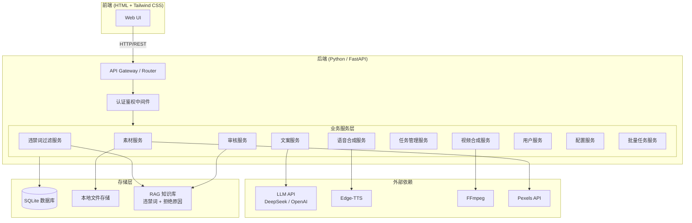
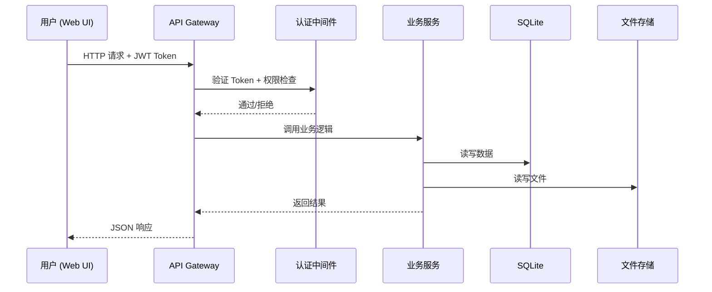
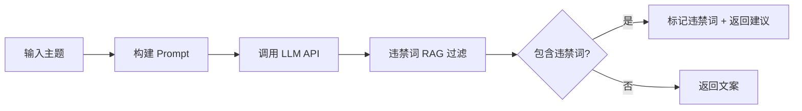
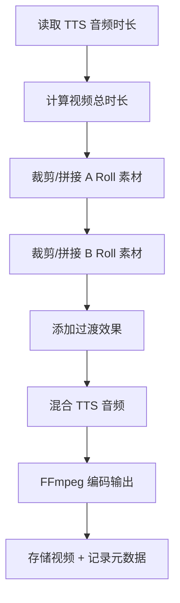
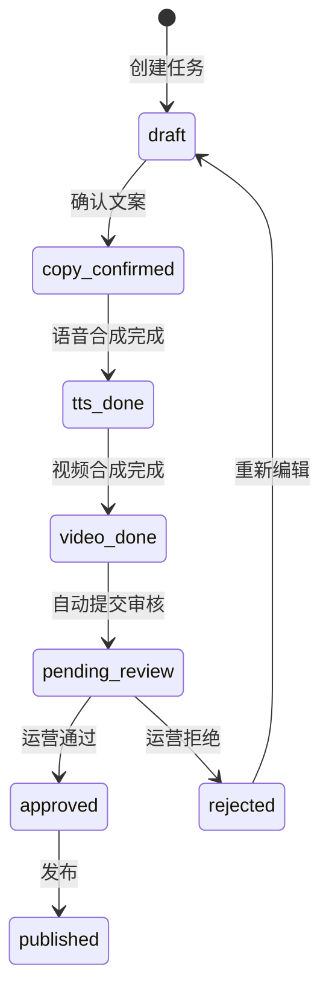
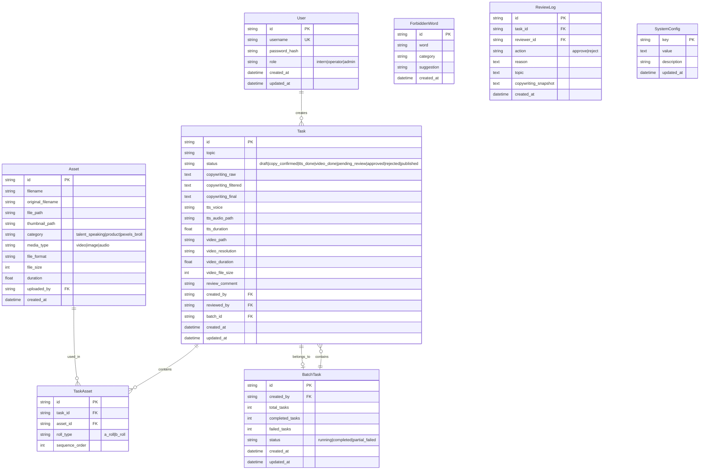

# 技术设计文档：视频生产平台

## 概述（Overview）

本设计文档描述基于 MoneyPrinterTurbo 架构扩展的视频生产平台的技术方案。平台采用前后端分离架构：前端使用 HTML + Tailwind CSS 构建 SPA 风格的 Web UI，后端基于 Python（FastAPI）提供 RESTful API。

核心设计目标：
- 让实习生通过简单的 Web UI 完成从主题输入到视频产出的全流程
- 运营人员终审把关，拒绝原因写入 RAG 知识库实现 AI 自我迭代
- 基于 FFmpeg 的 A roll/B roll 混剪合成
- 批量任务并发控制与队列管理
- 三级角色权限体系（实习生/运营/管理员）

## 架构（Architecture）

### 系统架构图



### 技术选型

| 层级 | 技术 | 说明 |
|------|------|------|
| 前端 | HTML + Tailwind CSS + Alpine.js | 轻量级前端，Alpine.js 处理交互逻辑 |
| 后端框架 | FastAPI (Python) | 继承 MoneyPrinterTurbo 的 Python 生态 |
| 数据库 | SQLite | 轻量级，适合单机部署的初期阶段 |
| 文件存储 | 本地文件系统 | 素材和生成视频存储在本地目录 |
| 任务队列 | asyncio + 内存队列 | 批量任务并发控制，初期无需 Celery |
| RAG 知识库 | 基于文本文件 + 向量检索（ChromaDB） | 违禁词库和审核拒绝原因存储 |
| 认证 | JWT Token | 基于用户名密码登录，JWT 鉴权 |


### 请求流程



## 组件与接口（Components and Interfaces）

### 1. 素材服务（AssetService）

负责素材的上传、存储、检索和删除。

**API 接口：**

| 方法 | 路径 | 说明 | 权限 |
|------|------|------|------|
| POST | `/api/assets/upload` | 上传素材文件 | Admin |
| GET | `/api/assets` | 检索素材列表（支持分类筛选、关键词搜索、分页） | Intern, Operator, Admin |
| GET | `/api/assets/{id}` | 获取素材详情 | Intern, Operator, Admin |
| DELETE | `/api/assets/{id}` | 删除素材 | Admin |

**上传校验逻辑：**
- 文件格式白名单：视频（mp4, mov, avi）、图片（jpg, png, webp）、音频（mp3, wav, aac）
- 文件大小上限：从系统配置读取（默认 500MB）
- 必填字段：分类标签（talent_speaking / product / pexels_broll）

**文件存储结构：**
```
storage/
  assets/
    {asset_id}/
      original.{ext}      # 原始文件
      thumbnail.jpg        # 缩略图（视频取首帧，图片缩放）
```

### 2. 文案服务（CopywritingService）

调用 LLM 生成视频文案，集成违禁词过滤。

**API 接口：**

| 方法 | 路径 | 说明 | 权限 |
|------|------|------|------|
| POST | `/api/copywriting/generate` | 根据主题生成文案 | Intern, Admin |
| PUT | `/api/copywriting/{task_id}` | 编辑文案内容 | Intern, Admin |
| POST | `/api/copywriting/{task_id}/confirm` | 确认锁定文案 | Intern, Admin |
| GET | `/api/copywriting/{task_id}` | 获取文案详情 | Intern, Operator, Admin |

**生成流程：**


### 3. 违禁词过滤服务（ForbiddenWordService）

基于 RAG 知识库检测和过滤文案中的敏感内容。

**API 接口：**

| 方法 | 路径 | 说明 | 权限 |
|------|------|------|------|
| POST | `/api/forbidden-words/check` | 检测文案中的违禁词 | Intern, Admin |
| GET | `/api/forbidden-words` | 获取违禁词列表 | Admin |
| POST | `/api/forbidden-words` | 添加违禁词 | Admin |
| DELETE | `/api/forbidden-words/{id}` | 删除违禁词 | Admin |
| POST | `/api/forbidden-words/import` | 批量导入违禁词 | Admin |

**过滤机制：**
- 使用 ChromaDB 存储违禁词向量，支持语义相似度匹配
- 同时支持精确匹配（关键词列表）和语义匹配（向量检索）
- 返回结果包含：匹配到的违禁词、在文案中的位置、替换建议

### 4. 语音合成服务（TTSService）

将确认的文案转换为语音音频。

**API 接口：**

| 方法 | 路径 | 说明 | 权限 |
|------|------|------|------|
| POST | `/api/tts/{task_id}/synthesize` | 触发语音合成 | Intern, Admin |
| GET | `/api/tts/voices` | 获取可用语音角色列表 | Intern, Admin |
| POST | `/api/tts/preview` | 预览试听语音效果 | Intern, Admin |

**语音存储：**
```
storage/
  tasks/
    {task_id}/
      tts_audio.mp3        # 合成的语音文件
```

### 5. 视频合成服务（CompositionService）

基于 FFmpeg 执行 A roll/B roll 混剪合成。

**API 接口：**

| 方法 | 路径 | 说明 | 权限 |
|------|------|------|------|
| POST | `/api/composition/{task_id}/compose` | 触发视频合成 | Intern, Admin |
| GET | `/api/composition/{task_id}/status` | 查询合成进度 | Intern, Admin |

**合成参数：**
```json
{
  "task_id": "string",
  "a_roll_assets": ["asset_id_1", "asset_id_2"],
  "b_roll_assets": ["asset_id_3", "asset_id_4"],
  "transition": "fade",
  "resolution": "1080x1920",
  "bitrate": "8M"
}
```

**合成流程：**


### 6. 任务管理服务（TaskService）

管理视频生成任务的生命周期。

**API 接口：**

| 方法 | 路径 | 说明 | 权限 |
|------|------|------|------|
| GET | `/api/tasks` | 获取任务列表（支持状态筛选） | Intern, Operator, Admin |
| GET | `/api/tasks/{id}` | 获取任务详情 | Intern, Operator, Admin |
| POST | `/api/tasks` | 创建任务（单个主题） | Intern, Admin |

**任务状态机：**


### 7. 批量任务服务（BatchService）

管理批量视频生成任务。

**API 接口：**

| 方法 | 路径 | 说明 | 权限 |
|------|------|------|------|
| POST | `/api/batches` | 创建批量任务 | Intern, Admin |
| GET | `/api/batches` | 获取批量任务列表 | Intern, Operator, Admin |
| GET | `/api/batches/{id}` | 获取批量任务详情（含子任务状态） | Intern, Operator, Admin |
| POST | `/api/batches/upload-csv` | 上传 CSV 主题列表 | Intern, Admin |

**并发控制：**
- 使用 asyncio.Semaphore 控制最大并发数（默认 3）
- 超出并发限制的任务进入内存队列排队
- 单个子任务失败不影响其余子任务执行

### 8. 审核服务（ReviewService）

运营终审视频，拒绝原因写入 RAG 知识库。

**API 接口：**

| 方法 | 路径 | 说明 | 权限 |
|------|------|------|------|
| GET | `/api/reviews/pending` | 获取待审核任务列表 | Operator, Admin |
| POST | `/api/reviews/{task_id}/approve` | 通过视频 | Operator, Admin |
| POST | `/api/reviews/{task_id}/reject` | 拒绝视频（含原因） | Operator, Admin |

**RAG 自我迭代机制：**
- 运营拒绝视频时，拒绝原因 + 关联文案 + 视频主题写入 ChromaDB
- 后续文案生成时，LLM prompt 中注入相关拒绝历史作为负面示例
- 随着拒绝记录积累，系统逐步学会规避同类问题

### 9. 用户服务（UserService）

用户认证和角色权限管理。

**API 接口：**

| 方法 | 路径 | 说明 | 权限 |
|------|------|------|------|
| POST | `/api/auth/login` | 用户登录 | 公开 |
| GET | `/api/users` | 获取用户列表 | Admin |
| POST | `/api/users` | 创建用户 | Admin |
| PUT | `/api/users/{id}` | 更新用户信息/角色 | Admin |
| DELETE | `/api/users/{id}` | 删除用户 | Admin |

**权限矩阵：**

| 功能 | Intern | Operator | Admin |
|------|--------|----------|-------|
| 浏览素材 | ✅ | ✅ | ✅ |
| 上传/删除素材 | ❌ | ❌ | ✅ |
| 生成文案 | ✅ | ❌ | ✅ |
| 编辑文案 | ✅ | ❌ | ✅ |
| 语音合成 | ✅ | ❌ | ✅ |
| 视频合成 | ✅ | ❌ | ✅ |
| 查看任务 | ✅（仅自己） | ✅（待审核） | ✅（全部） |
| 审核视频 | ❌ | ✅ | ✅ |
| 管理用户 | ❌ | ❌ | ✅ |
| 系统配置 | ❌ | ❌ | ✅ |
| 管理违禁词 | ❌ | ❌ | ✅ |

### 10. 配置服务（ConfigService）

系统参数的动态配置管理。

**API 接口：**

| 方法 | 路径 | 说明 | 权限 |
|------|------|------|------|
| GET | `/api/config` | 获取所有配置项 | Admin |
| PUT | `/api/config` | 更新配置项 | Admin |


## 数据模型（Data Models）

### ER 关系图



### 核心数据模型说明

**User（用户）**
- `role` 字段枚举值：`intern`、`operator`、`admin`
- `password_hash` 使用 bcrypt 加密存储

**Asset（素材）**
- `category` 分类：`talent_speaking`（达人口播）、`product`（产品素材）、`pexels_broll`（Pexels 空镜）
- `media_type` 类型：`video`、`image`、`audio`
- `duration` 仅对视频和音频类型有值

**Task（任务）**
- 状态流转严格按照状态机定义执行
- `copywriting_raw`：LLM 原始生成文案
- `copywriting_filtered`：违禁词过滤后文案
- `copywriting_final`：实习生确认的最终文案
- 关联素材通过 `TaskAsset` 中间表管理

**BatchTask（批量任务）**
- 通过 `batch_id` 关联多个 Task
- `completed_tasks` 和 `failed_tasks` 实时更新

**ReviewLog（审核日志）**
- 拒绝时 `reason` + `topic` + `copywriting_snapshot` 写入 RAG 知识库
- 保留文案快照确保知识库数据完整性

**SystemConfig（系统配置）**
- Key-Value 结构存储所有可配置参数
- 预置 Key 包括：`llm_api_url`、`llm_api_key`、`llm_model`、`tts_voices`、`tts_speed`、`tts_volume`、`video_resolution`、`video_bitrate`、`video_format`、`upload_max_size`、`upload_allowed_formats`、`batch_max_concurrency`


## 正确性属性（Correctness Properties）

*正确性属性是系统在所有有效执行中都应保持为真的特征或行为——本质上是关于系统应该做什么的形式化陈述。属性是人类可读规范与机器可验证正确性保证之间的桥梁。*

### Property 1: 素材上传往返一致性

*For any* 合法的素材文件（视频/图片/音频）和有效的分类标签，上传后通过 API 查询该素材，返回的元数据（文件名、分类、上传时间、文件大小、时长）应与上传时的原始信息一致。

**Validates: Requirements 1.1, 1.2, 1.3**

### Property 2: 非法上传拒绝

*For any* 文件格式不在白名单中的文件，或文件大小超过系统配置上限的文件，上传请求应被拒绝并返回对应的错误提示，且素材库中不应新增任何记录。

**Validates: Requirements 1.4, 1.5**

### Property 3: 素材搜索过滤正确性

*For any* 素材集合和任意分类标签筛选条件，返回的所有素材应属于该分类；*For any* 关键词搜索，返回的所有素材的文件名应包含该关键词。

**Validates: Requirements 2.1, 2.2**

### Property 4: 素材列表字段完整性

*For any* 素材列表 API 返回的素材记录，应包含缩略图路径、文件名、分类、上传时间和时长信息，且所有字段非空（时长字段对图片类型可为 null）。

**Validates: Requirements 2.3**

### Property 5: 素材删除完整性

*For any* 已存在的素材，执行删除操作后，该素材的文件和数据库元数据记录应同时不存在。

**Validates: Requirements 2.4**

### Property 6: 素材分页约束

*For any* 分页请求，返回的记录数应不超过每页限制（默认 20），且所有页的记录合集应等于总记录集。

**Validates: Requirements 2.5**

### Property 7: LLM Prompt 模板包含

*For any* 文案生成请求，发送给 LLM API 的 prompt 应包含系统预设的 prompt 模板内容，且主题信息应被正确嵌入模板中。

**Validates: Requirements 3.1, 3.2**

### Property 8: LLM 调用失败处理

*For any* LLM API 调用失败或超时场景，系统应返回明确的错误提示，且错误日志中应记录该失败事件。

**Validates: Requirements 3.5**

### Property 9: 违禁词检测完整性

*For any* 包含已知违禁词的文案文本，违禁词过滤器应检测到所有违禁词，返回结果应包含每个违禁词的位置、修改建议，且过滤状态应为"包含违禁词"；*For any* 不包含违禁词的文案，过滤状态应为"通过"。

**Validates: Requirements 4.1, 4.2, 4.4**

### Property 10: 违禁词 CRUD 往返一致性

*For any* 违禁词条目，添加后应能在知识库中检索到；删除后应不再出现在知识库中；批量导入的所有条目应全部可检索。

**Validates: Requirements 4.3**

### Property 11: 违禁词过滤保留对比记录

*For any* 经过违禁词过滤的文案，系统应同时保留原始文案和过滤后文案的记录，两者应可独立查询。

**Validates: Requirements 4.5**

### Property 12: 文案编辑触发重新过滤

*For any* 已生成的文案，当实习生修改文案内容后，系统应自动重新执行违禁词检测，过滤结果应反映修改后的文案内容。

**Validates: Requirements 5.2**

### Property 13: 文案确认锁定

*For any* 已确认的文案，其状态应为"已确认"，且后续的编辑请求应被拒绝，文案内容应保持不变。

**Validates: Requirements 5.3**

### Property 14: TTS 合成产出与元数据

*For any* 状态为"已确认"的文案文本，触发 TTS 合成后应产生一个非空的音频文件，且任务记录中应包含正确的音频文件路径和音频时长。

**Validates: Requirements 6.1, 6.4**

### Property 15: TTS 失败处理

*For any* TTS 合成失败场景，系统应返回失败原因，且任务状态应允许重新触发合成。

**Validates: Requirements 6.5**

### Property 16: 视频合成产出与元数据

*For any* 包含有效 A roll 素材、B roll 素材和 TTS 音频的合成请求，合成完成后应产生一个视频文件，且任务记录中应包含视频的分辨率、时长和文件大小。

**Validates: Requirements 7.1, 7.5**

### Property 17: A/B Roll 素材分离

*For any* 视频合成请求，A roll 和 B roll 的素材来源应分别指定，合成引擎应正确区分并使用两类素材。

**Validates: Requirements 7.2**

### Property 18: 视频时长匹配 TTS 音频时长

*For any* 合成的视频，其总时长应与 TTS 音频时长近似相等（误差不超过 1 秒）。

**Validates: Requirements 7.3**

### Property 19: 视频输出参数可配置

*For any* 配置的输出分辨率和码率，合成的视频应匹配该配置值。

**Validates: Requirements 7.7**

### Property 20: FFmpeg 合成失败处理

*For any* FFmpeg 执行失败场景，系统应记录 FFmpeg 错误日志并返回合成失败的提示。

**Validates: Requirements 7.6**

### Property 21: 任务状态机不变量

*For any* 任务，其状态流转应严格遵循定义的状态机：draft → copy_confirmed → tts_done → video_done → pending_review → approved/rejected。任何不符合状态机的状态转换应被拒绝。视频合成完成后应自动转为 pending_review；运营通过后应转为 approved；运营拒绝后应转为 rejected。

**Validates: Requirements 8.1, 8.2, 10.1, 10.5, 10.6**

### Property 22: 任务列表状态筛选

*For any* 任务状态筛选条件，返回的所有任务应具有该状态，且任务记录应包含主题、状态、创建时间和更新时间字段。

**Validates: Requirements 8.3, 8.4**

### Property 23: 批量任务创建正确性

*For any* 包含 N 个主题且每个主题指定 V 个版本的批量提交，系统应创建 N × V 个独立的 Task，所有 Task 应关联到同一个 Batch_Task 记录，且 Batch_Task 的 total_tasks 应等于 N × V。

**Validates: Requirements 9.1, 9.2, 9.3**

### Property 24: 批量任务并发限制

*For any* 批量任务执行过程中，同时处于运行状态的子任务数量应不超过系统配置的最大并发数。

**Validates: Requirements 9.4**

### Property 25: 批量任务进度计算

*For any* 批量任务，其进度百分比应等于 completed_tasks / total_tasks × 100，且 completed_tasks + failed_tasks + running_tasks + pending_tasks 应等于 total_tasks。

**Validates: Requirements 9.5**

### Property 26: 批量任务故障隔离

*For any* 批量任务中某个子任务失败，其余子任务应继续执行直到完成或各自失败，不受已失败任务影响。

**Validates: Requirements 9.6**

### Property 27: 审核拒绝必须填写原因

*For any* 审核拒绝操作，如果未提供拒绝原因，系统应拒绝该操作并返回错误提示。

**Validates: Requirements 10.4**

### Property 28: 审核拒绝写入 RAG 知识库

*For any* 审核拒绝操作，拒绝原因、关联主题和文案快照应被写入 RAG 知识库，且后续可通过知识库检索到该记录。

**Validates: Requirements 10.7**

### Property 29: 角色权限访问控制

*For any* 用户角色和操作组合，系统应严格按照权限矩阵执行：Intern 仅能执行浏览素材、生成文案、编辑文案、语音合成、视频合成、查看自己的任务；Operator 仅能执行查看待审核列表、预览视频、通过/拒绝操作；Admin 可执行所有操作。超出权限的操作应返回 403 错误。

**Validates: Requirements 11.2, 11.3, 11.4, 11.5**

### Property 30: 登录认证正确性

*For any* 用户名和密码组合，如果匹配数据库中的记录，登录应成功并返回有效的 JWT Token；如果不匹配，登录应失败并返回认证错误。

**Validates: Requirements 11.6**

### Property 31: 系统配置往返一致性与持久化

*For any* 系统配置项（LLM 参数、TTS 参数、视频输出参数、上传限制），更新后通过 API 查询应返回更新后的值，且服务重启后配置值应保持不变。

**Validates: Requirements 13.1, 13.2, 13.3, 13.4, 13.6**

### Property 32: 配置变更即时生效

*For any* 系统配置变更，变更后的下一次相关操作应使用新的配置值，无需重启服务。

**Validates: Requirements 13.5**


## 错误处理（Error Handling）

### 错误响应格式

所有 API 错误统一返回以下 JSON 格式：

```json
{
  "error": {
    "code": "ERROR_CODE",
    "message": "人类可读的错误描述",
    "details": {}
  }
}
```

### 错误分类与处理策略

| 错误类型 | HTTP 状态码 | 错误码 | 处理策略 |
|----------|------------|--------|----------|
| 认证失败 | 401 | `AUTH_FAILED` | 返回登录页面 |
| 权限不足 | 403 | `PERMISSION_DENIED` | 提示无权限 |
| 资源不存在 | 404 | `NOT_FOUND` | 提示资源不存在 |
| 文件格式不支持 | 400 | `UNSUPPORTED_FORMAT` | 提示支持的格式列表 |
| 文件过大 | 400 | `FILE_TOO_LARGE` | 提示最大文件大小 |
| 缺少必填字段 | 400 | `MISSING_FIELD` | 提示缺少的字段名 |
| 文案已锁定 | 409 | `COPY_LOCKED` | 提示文案已确认不可编辑 |
| 状态转换非法 | 409 | `INVALID_STATE_TRANSITION` | 提示当前状态和允许的操作 |
| 拒绝原因为空 | 400 | `REJECTION_REASON_REQUIRED` | 提示必须填写拒绝原因 |
| LLM API 失败 | 502 | `LLM_API_ERROR` | 记录日志，提示重试 |
| LLM API 超时 | 504 | `LLM_API_TIMEOUT` | 记录日志，提示重试 |
| TTS 合成失败 | 500 | `TTS_SYNTHESIS_FAILED` | 记录日志，允许重试 |
| FFmpeg 执行失败 | 500 | `FFMPEG_ERROR` | 记录 FFmpeg 日志，提示重试 |
| 违禁词检测到 | 200 | N/A | 正常返回，标记违禁词位置 |
| 批量任务子任务失败 | N/A | `SUBTASK_FAILED` | 记录失败，继续执行其余子任务 |

### 日志策略

- 所有错误记录到 `logs/error.log`，包含时间戳、请求 ID、错误详情
- LLM API 调用记录到 `logs/llm.log`，包含请求/响应摘要
- FFmpeg 执行记录到 `logs/ffmpeg.log`，包含完整命令和输出
- 审核操作记录到 `logs/review.log`，包含审核人、操作、原因

### 重试策略

| 操作 | 自动重试 | 最大重试次数 | 重试间隔 |
|------|---------|-------------|---------|
| LLM API 调用 | 是 | 2 | 5 秒 |
| TTS 合成 | 否（手动重试） | N/A | N/A |
| FFmpeg 合成 | 否（手动重试） | N/A | N/A |
| 文件上传 | 否（手动重试） | N/A | N/A |

## 测试策略（Testing Strategy）

### 测试方法

本项目采用双轨测试策略：

1. **单元测试**：验证具体示例、边界条件和错误场景
2. **属性测试（Property-Based Testing）**：验证跨所有输入的通用属性

两者互补：单元测试捕获具体 bug，属性测试验证通用正确性。

### 属性测试配置

- **测试库**：[Hypothesis](https://hypothesis.readthedocs.io/)（Python 属性测试库）
- **每个属性测试最少运行 100 次迭代**
- **每个测试必须用注释引用设计文档中的属性编号**
- **标签格式**：`Feature: video-production-platform, Property {number}: {property_text}`
- **每个正确性属性由一个属性测试实现**

### 测试分层

| 层级 | 工具 | 覆盖范围 |
|------|------|----------|
| 单元测试 | pytest | 各服务的核心逻辑、数据校验、状态转换 |
| 属性测试 | Hypothesis | 32 个正确性属性的全输入覆盖 |
| 集成测试 | pytest + httpx | API 端到端流程、服务间交互 |
| 前端测试 | 手动测试 | UI 交互、响应式布局、用户体验 |

### 单元测试重点

- 素材上传的格式和大小校验（边界值：刚好超过上限、刚好在上限内）
- 任务状态机的合法/非法转换
- 违禁词精确匹配和语义匹配
- JWT Token 生成和验证
- 权限矩阵的每个角色-操作组合
- 批量任务并发控制的边界条件
- FFmpeg 命令构建的正确性

### 属性测试重点

每个正确性属性（Property 1-32）对应一个 Hypothesis 属性测试：

- **Property 1**: `Feature: video-production-platform, Property 1: 素材上传往返一致性` — 生成随机合法素材文件和分类标签，验证上传后查询返回一致的元数据
- **Property 2**: `Feature: video-production-platform, Property 2: 非法上传拒绝` — 生成随机非法文件格式和超大文件，验证上传被拒绝
- **Property 9**: `Feature: video-production-platform, Property 9: 违禁词检测完整性` — 生成包含随机违禁词的文案，验证所有违禁词被检测到
- **Property 21**: `Feature: video-production-platform, Property 21: 任务状态机不变量` — 生成随机状态转换序列，验证合法转换成功、非法转换被拒绝
- **Property 23**: `Feature: video-production-platform, Property 23: 批量任务创建正确性` — 生成随机主题数量和版本数量，验证创建的任务数和关联关系
- **Property 29**: `Feature: video-production-platform, Property 29: 角色权限访问控制` — 生成随机角色和操作组合，验证权限矩阵执行正确
- **Property 31**: `Feature: video-production-platform, Property 31: 系统配置往返一致性` — 生成随机配置值，验证更新后查询返回一致

（其余属性测试同理，每个 Property 对应一个 Hypothesis 测试用例）

### 集成测试场景

1. **完整视频生成流程**：输入主题 → 生成文案 → 违禁词过滤 → 编辑确认 → TTS 合成 → 选择素材 → 视频合成 → 提交审核 → 通过发布
2. **批量生成流程**：提交多主题 → 并发执行 → 部分失败 → 验证故障隔离
3. **审核拒绝 RAG 迭代**：拒绝视频 → 验证 RAG 写入 → 再次生成文案 → 验证 prompt 包含拒绝历史
4. **权限隔离**：不同角色登录 → 尝试越权操作 → 验证拒绝

